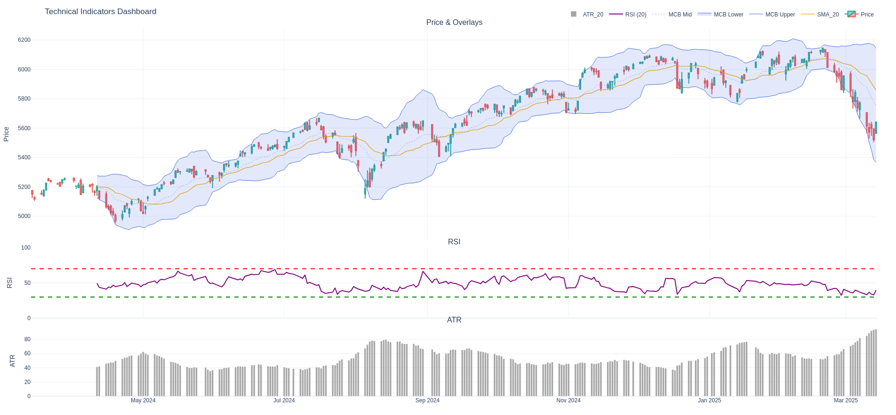

# Tutorial 2: Visualizing Indicators with Plotly

> Build on Tutorial 1 by adding rich, interactive technical charts.

This tutorial is the second in the series:
- [01 - Using PyTechnicalIndicators with pandas](./01_pandas_and_pytechnicalindicators.md)
- 02 - Using PyTechnicalIndicators with Plotly
- [03 - More advanced use cases for PyTechnicalIndicators](./03_advanced_pytechnicalindicators.md)
- [04 - Connecting to an API](./04_api_connection.md)
- [05 - Using PyTechnicalIndicators with Jupyter Notebooks](./05_using_jupyter_and_pytechnicalindicators.ipynb)

---

## 🎯 Goal

Add interactive Plotly charts on top of the engineered indicators from Tutorial 1:
- Candlestick chart from CSV OHLCV data
- Overlay moving average (SMA)
- Overlay Moving Constant Bands
- Add RSI in its own panel (with threshold lines)
- Add ATR in a third panel
- Optional: interactive toggling of indicators
- Optional: static export

---

## 📦 Prerequisites

You should already have:
- A `prices.csv` file (with at least columns: `Date,Open,High,Low,Close`)
- The indicator columns created in Tutorial 1 

Install Plotly (and optional static export helper):

```bash
pip install plotly 
```

---

## 📁 Data & Indicators Recap

If you already followed Tutorial 1 and have a DataFrame with:
- `SMA_20`
- `MCB_Lower`, `MCB_EMA`, `MCB_Upper`
- `RSI`
- `ATR_20`

Otherwise, copy the code from [tutorial 1](./examples/01_using_pandas_and_pytechnicalindicators.py)

---

## 📊 Creating a Multi-Panel Plotly Figure

Layout plan:
- Row 1: Candlestick + SMA + Bands (with shaded area between lower/upper)
- Row 2: RSI + threshold lines (70 / 30)
- Row 3: ATR (bar or line)

```python
import plotly.graph_objects as go
from plotly.subplots import make_subplots

fig = make_subplots(
    rows=3,
    cols=1,
    shared_xaxes=True,
    vertical_spacing=0.02,
    row_heights=[0.6, 0.2, 0.2],
    subplot_titles=("Price & Overlays", "RSI", "ATR")
)

# --- Row 1: Candlestick ---
fig.add_trace(
    go.Candlestick(
        x=df["Date"],
        open=df["Open"],
        high=df["High"],
        low=df["Low"],
        close=df["Close"],
        name="Price",
        increasing_line_color="#26a69a",
        decreasing_line_color="#ef5350",
        showlegend=True
    ),
    row=1, col=1
)

# --- Row 1: SMA ---
sma_col = "SMA_20"
if sma_col in df:
    fig.add_trace(
        go.Scatter(
            x=df["Date"], y=df[sma_col],
            name=sma_col,
            line=dict(color="orange", width=1.3),
            hovertemplate="SMA %{y:.2f}<extra></extra>"
        ),
        row=1, col=1
    )

# --- Row 1: Moving Constant Bands (shaded) ---
if {"MCB_Lower","MCB_Upper","MCB_Middle"}.issubset(df.columns):
    fig.add_trace(
        go.Scatter(
            x=df["Date"], y=df["MCB_Upper"],
            name="MCB Upper",
            line=dict(color="royalblue", width=1),
            hovertemplate="Upper %{y:.2f}<extra></extra>",
            opacity=0.7
        ),
        row=1, col=1
    )
    fig.add_trace(
        go.Scatter(
            x=df["Date"], y=df["MCB_Lower"],
            name="MCB Lower",
            line=dict(color="royalblue", width=1),
            fill="tonexty",
            fillcolor="rgba(65,105,225,0.15)",
            hovertemplate="Lower %{y:.2f}<extra></extra>",
            opacity=0.7
        ),
        row=1, col=1
    )
    fig.add_trace(
        go.Scatter(
            x=df["Date"], y=df["MCB_EMA"],
            name="MCB Mid",
            line=dict(color="royalblue", width=0.8, dash="dot"),
            hovertemplate="Mid %{y:.2f}<extra></extra>",
            opacity=0.6
        ),
        row=1, col=1
    )

# --- Row 2: RSI ---
if "RSI" in df:
    fig.add_trace(
        go.Scatter(
            x=df["Date"], y=df["RSI"],
            name="RSI (20)",
            line=dict(color="purple"),
            hovertemplate="RSI %{y:.2f}<extra></extra>"
        ),
        row=2, col=1
    )
    # Overbought / Oversold reference lines
    fig.add_hline(y=70, line_dash="dash", line_color="red", row=2, col=1)
    fig.add_hline(y=30, line_dash="dash", line_color="green", row=2, col=1)

# --- Row 3: ATR ---
atr_col = "ATR_20"
if atr_col in df:
    fig.add_trace(
        go.Bar(
            x=df["Date"], y=df[atr_col],
            name=atr_col,
            marker_color="gray",
            hovertemplate="ATR %{y:.2f}<extra></extra>",
            opacity=0.7
        ),
        row=3, col=1
    )

fig.update_layout(
    title=f"Technical Indicators Dashboard",
    legend=dict(orientation="h", yanchor="bottom", y=1.02, xanchor="right", x=1),
    xaxis_rangeslider_visible=False,
    template="plotly_white",
    margin=dict(l=40, r=40, t=60, b=40),
    hovermode="x unified"
)

# Improve y-axis titles
fig.update_yaxes(title_text="Price", row=1, col=1)
fig.update_yaxes(title_text="RSI",   row=2, col=1, range=[0,100])
fig.update_yaxes(title_text="ATR",   row=3, col=1)

fig.show()
```

---

## 💾 Static Export

Install Kaleido (already in prerequisites, requires chromium):

```bash
pip install -U kaleido
```

Then:

```python
fig.write_image("technical_dashboard.png", scale=2, width=1400, height=900)
```

---

## 🧪 Handling Missing Indicator Rows

Because rolling indicators start later:
- Leave initial NaNs (recommended for honesty)
- Or backfill using `df[sma_col] = df[sma_col].ffill()` (only if justified)
- Mask early bars with incomplete overlays using conditional visibility

---

## 🎨 Styling Tips

| Goal | Approach |
|------|----------|
| Thinner candlestick wicks | `go.Candlestick(..., whiskerwidth=0.4)` |
| Dark theme | `template="plotly_dark"` |
| Dynamic color on RSI | Add a second trace highlighting overbought/oversold zones |
| Band opacity tweak | Change `fillcolor="rgba(65,105,225,0.08)"` |

---

## 🧾 Common Visualization Pitfalls

| Issue | Cause | Fix |
|-------|-------|-----|
| Bands misaligned | Wrong index slicing | Ensure alignment uses `df.index[-len(bands):]` |
| RSI flatlining | Period too long / no volatility | Try shorter period or verify data quality |
| ATR bars obscure price | ATR added to row=1 | Use separate row or secondary y-axis |
| Export failure | Missing Kaleido | `pip install kaleido` |
| Date gaps in weekends | Exchange calendar | Accept or reindex trading days only |

---

## 🧪 Extending Further

Ideas you can try before the next tutorial:
- Add volume as a semi-transparent bar behind price (secondary y-axis)
- Add additional moving averages (e.g., SMA 50 / 200)
- Shade RSI > 70 and < 30 using shapes:
  ```python
  fig.add_shape(type="rect", xref="x", yref="y2",
                x0=df["Date"].min(), x1=df["Date"].max(),
                y0=70, y1=100, fillcolor="rgba(255,0,0,0.05)", line_width=0, row=2, col=1)
  ```

---

## 🧩 Putting It All Together

A runnable example of the full code can be found in [`02_using_plotly_and_pytechnicalindicators.py`](./examples/02_using_plotly_and_pytechnicalindicators.py)

```bash
python3 examples/02_using_plotly_and_pytechnicalindicators.py
```
**Output:**


---

## 🛡️ Disclaimer

Educational example only. Not financial advice. Validate indicator logic before using in live or automated systems.

---

## ✅ Next Step

Continue to:
[03 - More advanced use cases for PyTechnicalIndicators](./03_advanced_pytechnicalindicators.md)

In the next tutorial we will iterate programmatically over indicator modules, auto-generate features, and discuss batch computations.

---

Happy charting! 🦀🐍📈
