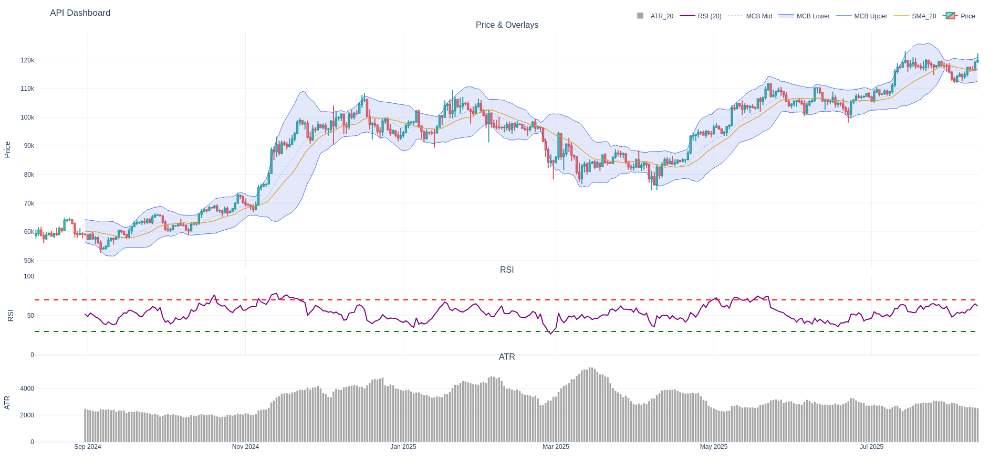

# Tutorial 4: Connecting to a Market Data API

> Learn how to fetch fresh OHLCV data from a public API, process it into a DataFrame, and analyze it with PyTechnicalIndicators.  
> This workflow enables automated, up-to-date, and repeatable research pipelines.

Series so far:
- [01 - Using PyTechnicalIndicators with pandas](./01_pandas_and_pytechnicalindicators.md)
- [02 - Using PyTechnicalIndicators with Plotly](./02_using_plotly_and_pytechnicalindicators.md)
- [03 - Systematically Evaluating RSI Variants](./03_advanced_pytechnicalindicators.md)
- 04 - Connecting to a Market Data API (this file)
- [05 - Using PyTechnicalIndicators with Jupyter Notebooks](./05_using_jupyter_and_pytechnicalindicators.ipynb)

---

## 🎯 Goal

- Fetch OHLCV (Open, High, Low, Close, Volume) data from a free market data API
- Parse JSON into a pandas DataFrame
- Clean and align the data for use with PyTechnicalIndicators
- Run your existing indicator pipeline on fresh data

---

## 📦 Prerequisites

- Python 3.10+
- pandas
- requests (for HTTP queries)
- PyTechnicalIndicators

```bash
pip install pandas requests pytechnicalindicators
```

---

## 🔍 Using a Free Market Data API (Binance)

We'll use Binance's public API, which provides free cryptocurrency OHLCV data with no API key required.

**Docs:** [Binance API - Kline/Candlestick Data](https://binance-docs.github.io/apidocs/spot/en/#kline-candlestick-data)

Example endpoint for daily candles of BTCUSDT:
```
https://api.binance.com/api/v3/klines?symbol=BTCUSDT&interval=1d&limit=365
```
- Replace `BTCUSDT` with any supported crypto symbol.
- `interval` can be `1d` (daily), `1h` (hourly), etc.
- `limit` controls how many bars.

---

## 🧑‍💻 Fetching Data from marketdata.app

```python
import requests
import pandas as pd

def fetch_marketdata_ohlcv(symbol="BTCUSDT", interval="1d", limit=365):
    url = "https://api.binance.com/api/v3/klines"
    params = {"symbol": symbol, "interval": interval, "limit": limit}
    resp = requests.get(url, params=params)
    resp.raise_for_status()
    data = resp.json()
    # Binance returns a list of lists:
    # [Open time, Open, High, Low, Close, Volume, Close time, ...]
    df = pd.DataFrame(data, columns=[
        "OpenTime", "Open", "High", "Low", "Close", "Volume",
        "CloseTime", "QuoteAssetVolume", "NumTrades", "TakerBuyBase", "TakerBuyQuote", "Ignore"
    ])
    df["Date"] = pd.to_datetime(df["OpenTime"], unit="ms")
    cols = ["Date", "Open", "High", "Low", "Close", "Volume"]
    df = df[cols].astype({"Open": float, "High": float, "Low": float, "Close": float, "Volume": float})
    df = df.sort_values("Date").reset_index(drop=True)
    return df

# Example usage
df = fetch_marketdata_ohlcv(symbol="BTCUSDT", interval="1d", limit=365)
print(df.head())
```

---

## ⚙️ Running Indicators on API Data

You can now pass the `df` to the indicators just as we did in [Tutorial 1](./01_using_pandas_and_pytechnicalindicators.md).

---

## 📊 Visualization

Use Plotly as in [Tutorial 2](02_using_plotly_and_pytechnicalindicators.md)
 to quickly visualize live data with overlays:


---

## 🔄 Extending Further

- Loop over multiple symbols and concatenate results for batch analysis.
- Use your custom indicator pipelines from previous tutorials on this fresh data.
- Add logic to check for new bars and only update as needed.
- Save or visualize your results for reporting or algorithmic research.

---

## 🛡️ Disclaimer

Always observe API rate limits and terms of use.  
This example is for educational purposes; for production, add robust error handling and logging.

---

## ✅ Next Step

Continue to: [05 - Using PyTechnicalIndicators with Jupyter Notebooks](./05_using_jupyter_and_pytechnicalindicators.md)

---

Happy fetching! 🦀🐍🌐
