# PyTechnicalIndicators Picture Example

The script, `build_picture.py`, is intended to be run as is, and will generate `.png` pictures that will be saved under
`assets` for each function.

## How to run the code
Once the repo has been cloned, from the command line run
```shell
cd Picture_Example
pip3 install PyTechnicalIndicators
python3 build_picture.py
```

`example.csv` can be replaced by any tab seperated `.csv`. If the name of the file is changed make sure `build_picture.py`
is updated on line 33:
```python
# From
data = pandas.read_csv("example.csv", sep='\t', index_col=0, parse_dates=True)
# To
data = pandas.read_csv("new_file_name.csv", sep='\t', index_col=0, parse_dates=True)
```

/!\ Disclaimer /!\ 
The code is not written well, and this is by design, to make it more readable and obvious. If the file is going to be 
used, I recommend refactoring it, extracting most things into classes and function to stop the repetitive code.

## Explanation

### Basic Indicators
Basic functions, mostly included in the Python STL, but enhanced to allow the passing of lists, and for them to be 
calculated for a period

#### Mean
_From lines `125` to `215`_

Calculates the `mean` (or average) for a list of prices. No `single` version as caller can just use `statistic.mean()` 
function. In this example we calculate the weekly, monthly, and quarterly mean.
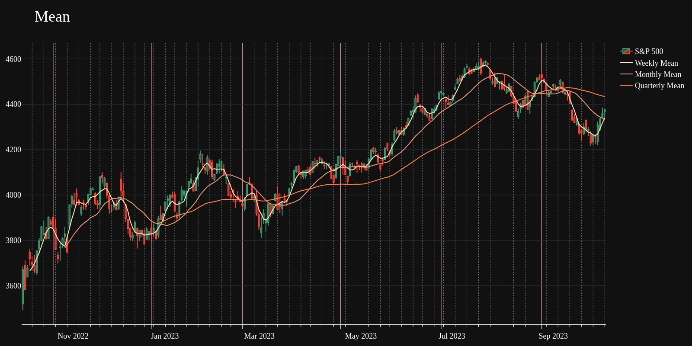

#### Median
_From lines `214` to `301`_

Calculates the `median` for a list of prices. No `single` version as caller can just use
`statistic.median()` function. In this example we calculate the weekly, monthly, and quarterly median.
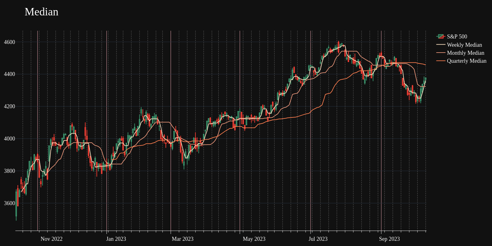

#### Standard Deviation
_From lines `303` to `390`_

Calculates the `standard_deviation` for a list of prices. No `single` version as caller can just use
`statistic.stdev()` function. In this example we calculate the weekly, monthly, and quarterly standard deviation.
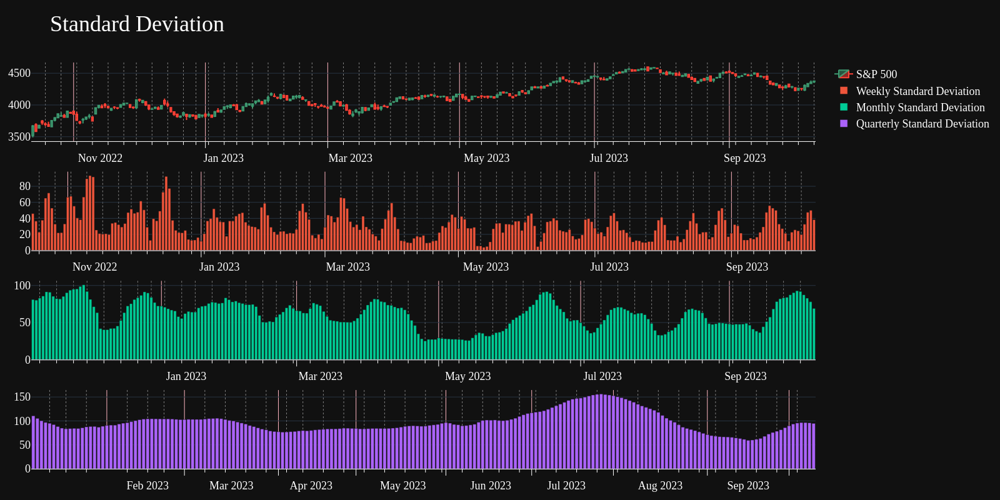

#### Variance
_From lines `392` to `379`_

Calculates the `variance` for a list of prices. No `single` version as caller can just use
`statistic.variance()` function. In this example we calculate the weekly, monthly, and quarterly variance.
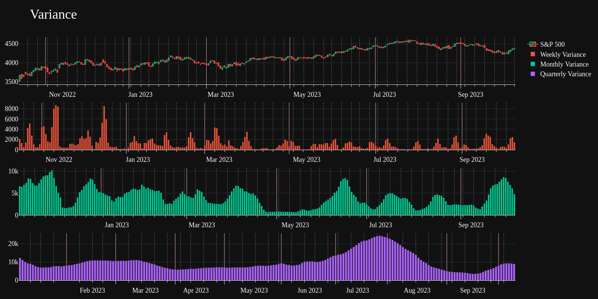

#### Mean Aboslute Deviation
_From lines `570` to `568`_

Calculates the `mean_absolute_deviation` for a list of prices. In this example we calculate the 
weekly, monthly, and quarterly mean absolute deviation.
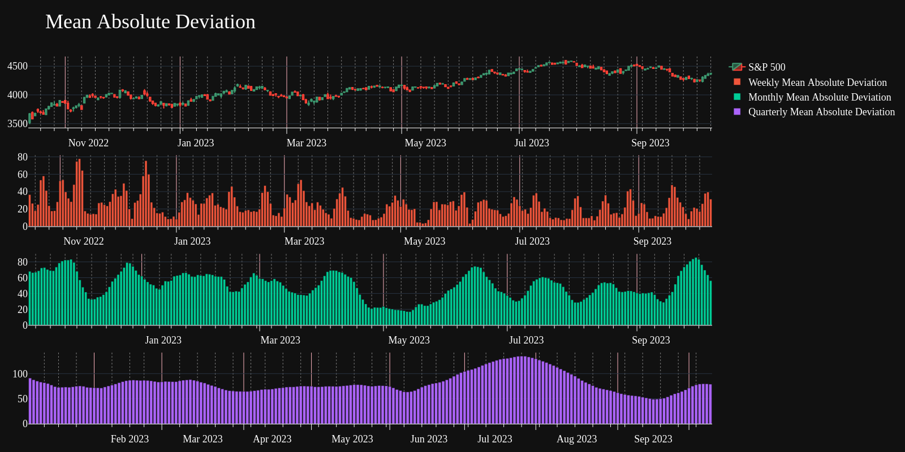

#### Median Absolute Deviation
_From lines `570` to `657`_

Calculates the `median_absolute_deviation` for a list of prices. In this example we calculate the 
weekly, monthly, and quarterly median absolute deviation.
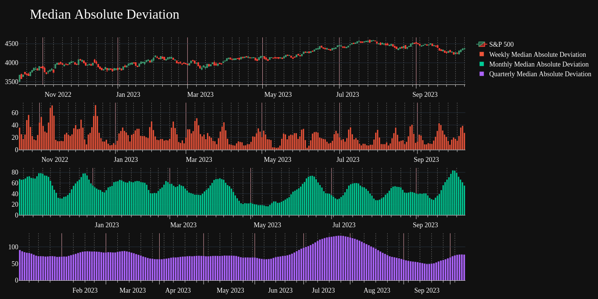

#### Mode Absolute Deviation
_From lines `659` to `568`_

Calculates the `mode_absolute_deviation` for a list of prices. In this example we calculate the 
weekly, monthly, and quarterly mode absolute deviation.
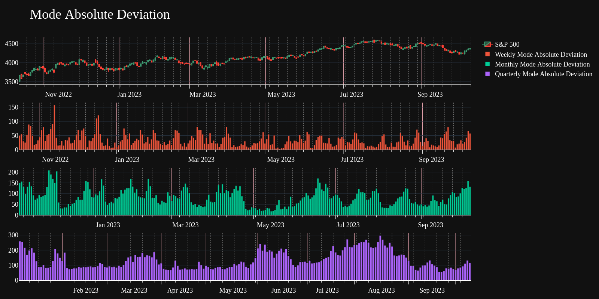

#### Logarithm
_From lines `748` to `568`_

Calculates the `log` for a list of prices. No `single` version as caller can just use
`math.log()` function.
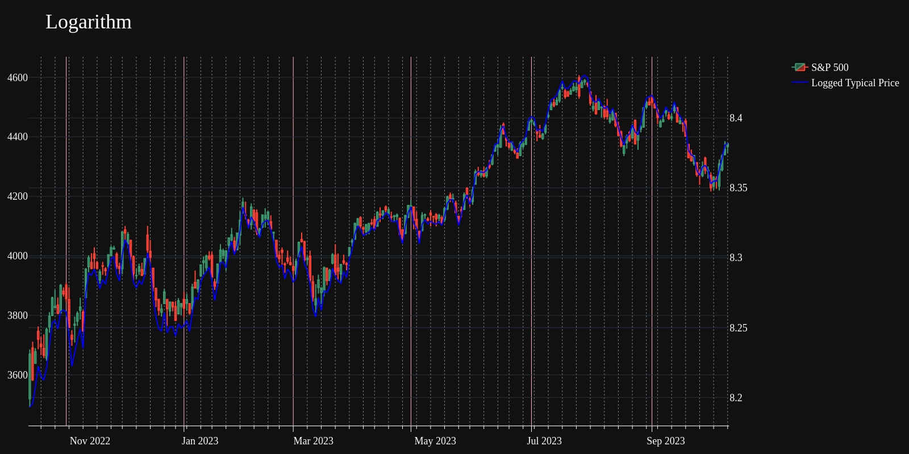

#### Log difference
_From lines `818` to `888`_

Calculates the `log_diff` for a list of prices. No `single` version as caller can just use
`math.log()` function and do the difference between log t-1 and t.
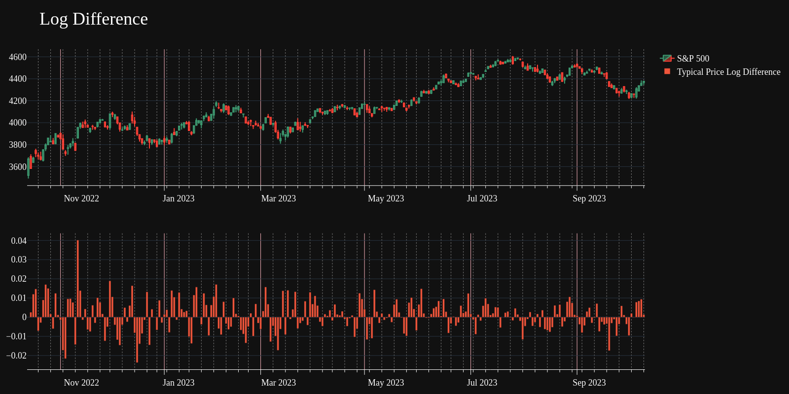

### Moving Averages

#### Moving Average
Calculates the `moving_average` for a list of prices. In this example we calculate the 
weekly, monthly, and quarterly moving average.
```python
# Bulk functions
weekly_ma = bulk_moving_average.moving_average(data['Typical Price'].tolist(), 5)
monthly_ma = bulk_moving_average.moving_average(data['Typical Price'].tolist(), 20)
quarterly_ma = bulk_moving_average.moving_average(data['Typical Price'].tolist(), 60)

# Single Functions
weekly_ma.append(single_moving_average.moving_average(data['Typical Price'][-4:].tolist() + [latest_typical_price]))
monthly_ma.append(single_moving_average.moving_average(data['Typical Price'][-19:].tolist() + [latest_typical_price]))
quarterly_ma.append(single_moving_average.moving_average(data['Typical Price'][-59:].tolist() + [latest_typical_price]))
```
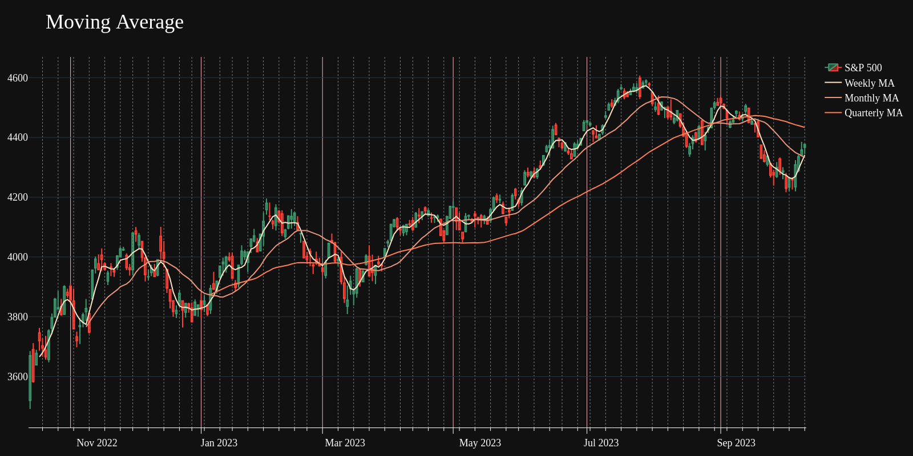

#### Smoothed moving average
Calculates the `smoothed_moving_average` for a list of prices. In this example we calculate the 
weekly, monthly, and quarterly smoothed moving average.
```python
# Bulk Functions
weekly_sma = bulk_moving_average.smoothed_moving_average(data['Typical Price'].tolist(), 5)
monthly_sma = bulk_moving_average.smoothed_moving_average(data['Typical Price'].tolist(), 20)
quarterly_sma = bulk_moving_average.smoothed_moving_average(data['Typical Price'].tolist(), 60)

# Single Functions
weekly_sma.append(single_moving_average.smoothed_moving_average(data['Typical Price'][-4:].tolist() + [latest_typical_price]))
monthly_sma.append(single_moving_average.smoothed_moving_average(data['Typical Price'][-19:].tolist() + [latest_typical_price]))
quarterly_sma.append(single_moving_average.smoothed_moving_average(data['Typical Price'][-59:].tolist() + [latest_typical_price]))
```
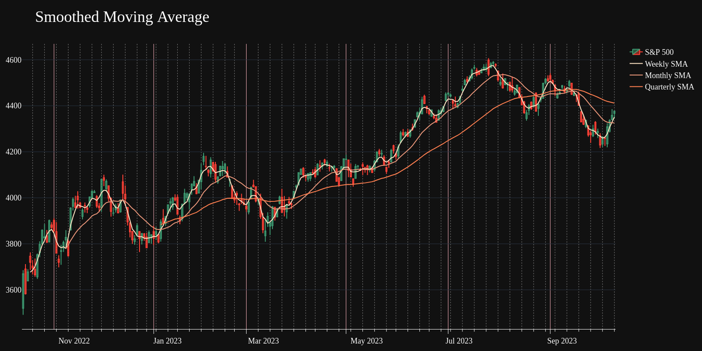

#### Exponential moving average
Calculates the `exponential_moving_average` for a list of prices. In this example we calculate the 
weekly, monthly, and quarterly exponential moving average.
```python
# Bulk Functions
weekly_ema = bulk_moving_average.exponential_moving_average(data['Typical Price'].tolist(), 5)
monthly_ema = bulk_moving_average.exponential_moving_average(data['Typical Price'].tolist(), 20)
quarterly_ema = bulk_moving_average.exponential_moving_average(data['Typical Price'].tolist(), 60)

# Single Functions
weekly_ema.append(single_moving_average.exponential_moving_average(data['Typical Price'][-4:].tolist() + [latest_typical_price]))
monthly_ema.append(single_moving_average.exponential_moving_average(data['Typical Price'][-19:].tolist() + [latest_typical_price]))
quarterly_ema.append(single_moving_average.exponential_moving_average(data['Typical Price'][-59:].tolist() + [latest_typical_price]))
```
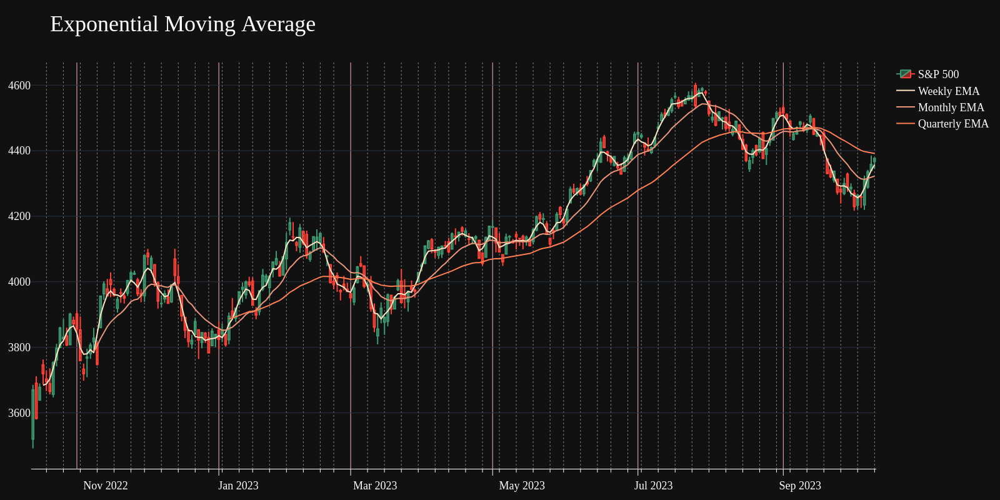

#### Personalised moving average
Calculates the `personalised_moving_average` for a list of prices. The personalised moving average allows the caller to
determine the alpha nominator and denominator. These are 2 and 1 for the exponential moving average, and 1 and 0 for the
smoothed moving average.

In this example we calculate the weekly, monthly, and quarterly personalised moving average.
```python
# Bulk Functions
weekly_pma = bulk_moving_average.personalised_moving_average(data['Typical Price'].tolist(), 5, 4, 2)
monthly_pma = bulk_moving_average.personalised_moving_average(data['Typical Price'].tolist(), 20, 4, 2)
quarterly_pma = bulk_moving_average.personalised_moving_average(data['Typical Price'].tolist(), 60, 4, 2)

# Single Functions
weekly_pma.append(single_moving_average.personalised_moving_average(data['Typical Price'][-4:].tolist() + [latest_typical_price], 4, 2))
monthly_pma.append(single_moving_average.personalised_moving_average(data['Typical Price'][-19:].tolist() + [latest_typical_price], 4, 2))
quarterly_pma.append(single_moving_average.personalised_moving_average(data['Typical Price'][-59:].tolist() + [latest_typical_price], 4, 2))
```


#### Moving Average Convergence Divergence
The bulk function calculates the MACD, Signal line, and the histogram. The single functions need to be called
independently and the histogram needs to be calculated.
```python
moving_average_convergence_divergence = bulk_moving_average.moving_average_convergence_divergence(data['Typical Price'].tolist())

macd = [i[0] for i in moving_average_convergence_divergence]
signal = [i[1] for i in moving_average_convergence_divergence]
histogram = [i[2] for i in moving_average_convergence_divergence]

macd.append(single_moving_average.macd_line(data['Typical Price'][-25:].tolist() + [latest_typical_price]))
signal.append(single_moving_average.signal_line(macd[-9:]))
histogram.append(macd[-1] - signal[-1])
```
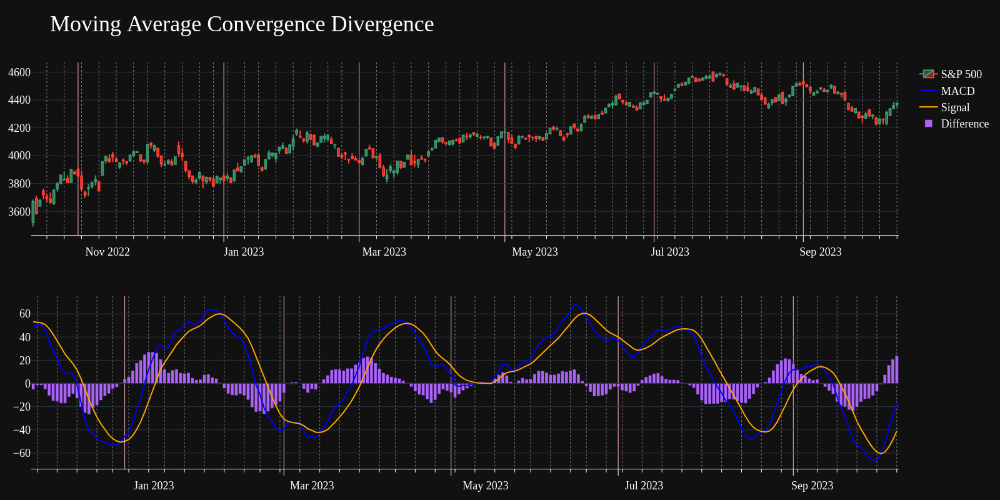

The MACD can also be personalised where the caller determines the MACD short and long period, the signal period, and the
moving average that is going to be used.
```python
personalised_moving_average_convergence_divergence = bulk_moving_average.moving_average_convergence_divergence(data['Typical Price'].tolist(), 5, 20, 5, 'ema')

personalised_macd = [i[0] for i in personalised_moving_average_convergence_divergence]
personalised_signal = [i[1] for i in personalised_moving_average_convergence_divergence]
personalised_histogram = [i[2] for i in personalised_moving_average_convergence_divergence]

personalised_macd.append(single_moving_average.macd_line(data['Typical Price'][-19:].tolist() + [latest_typical_price], 5, 20, 'ema'))
personalised_signal.append(single_moving_average.signal_line(personalised_macd[-5:], 'ema'))
personalised_histogram.append(personalised_macd[-1] - personalised_signal[-1])
```
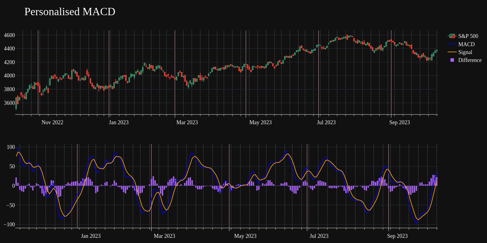

#### McGinley Dynamic
Calcualtes the `mcginley_dynamic` from a list of prices. In this example we calculate the 
weekly, monthly, and quarterly McGinley dynamic.
```python
# Bulk functions
weekly_mcginley_dynamic = bulk_moving_average.mcginley_dynamic(data['Typical Price'].tolist(), 5)
monthly_mcginley_dynamic = bulk_moving_average.mcginley_dynamic(data['Typical Price'].tolist(), 20)
quarterly_mcginley_dynamic = bulk_moving_average.mcginley_dynamic(data['Typical Price'].tolist(), 60)

# Single functions
weekly_mcginley_dynamic.append(single_moving_average.mcginley_dynamic(latest_typical_price, 5, weekly_mcginley_dynamic[-1]))
monthly_mcginley_dynamic.append(single_moving_average.mcginley_dynamic(latest_typical_price, 20, monthly_mcginley_dynamic[-1]))
quarterly_mcginley_dynamic.append(single_moving_average.mcginley_dynamic(latest_typical_price, 60, quarterly_mcginley_dynamic[-1]))
```
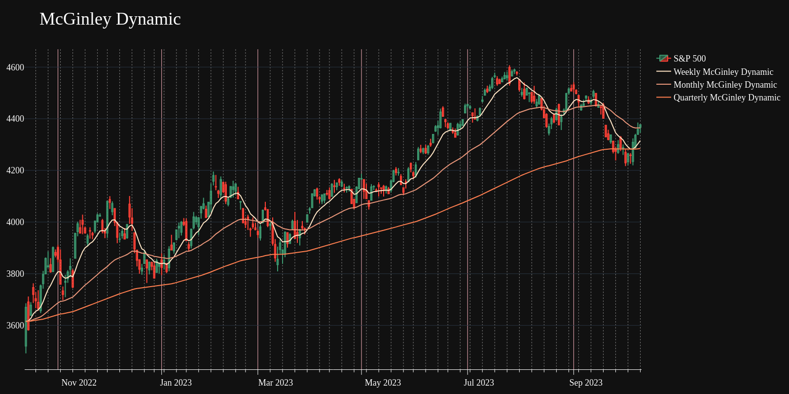

#### Moving Average Envelopes
Calcualtes the `moving_average_envelopes` from a list of prices.
```python
moving_average_envelope = bulk_moving_average.moving_average_envelopes(data['Typical Price'].tolist(), 20, 'ema', 2)

upper_envelope = [i[0] for i in moving_average_envelope]
moving_average = [i[1] for i in moving_average_envelope]
lower_envelope = [i[2] for i in moving_average_envelope]

next_point = single_moving_average.moving_average_envelopes(data['Typical Price'][-19:].tolist() + [latest_typical_price], 'ema', 2)
upper_envelope.append(next_point[0])
moving_average.append(next_point[1])
lower_envelope.append(next_point[2])
```
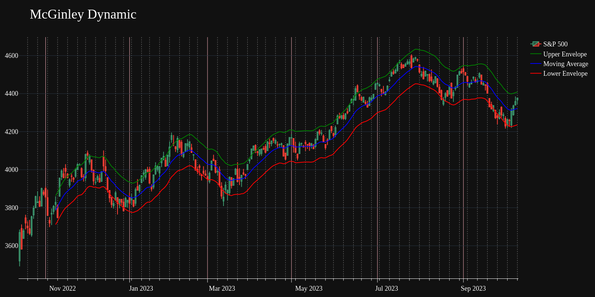

### Oscillators

#### Stochastic Oscillator
Calculates the `stochastic_oscillator`.
```python
# Bulk Function
stochastic_oscillator = bulk_oscillators.stochastic_oscillator(data['Close'].tolist())

# Single Function
stochastic_oscillator.append(single_oscillators.stochastic_oscillator(data['Close'][-13:].tolist()+[latest_close]))
```
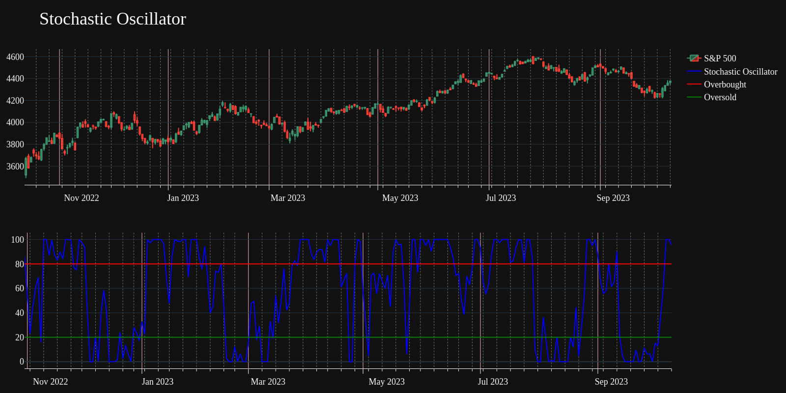

`stochastic_oscillator` allows the caller to determine the period to create a personalised version of the indicator.
```python
# Bulk function
weekly_so = bulk_oscillators.stochastic_oscillator(data['Close'].tolist(), 5)
monthly_so = bulk_oscillators.stochastic_oscillator(data['Close'].tolist(), 20)
quarterly_so = bulk_oscillators.stochastic_oscillator(data['Close'].tolist(), 60)

# Single function
weekly_so.append(single_oscillators.stochastic_oscillator(data['Close'][-4:].tolist()+[latest_close]))
monthly_so.append(single_oscillators.stochastic_oscillator(data['Close'][-19:].tolist()+[latest_close]))
quarterly_so.append(single_oscillators.stochastic_oscillator(data['Close'][-59:].tolist()+[latest_close]))
```
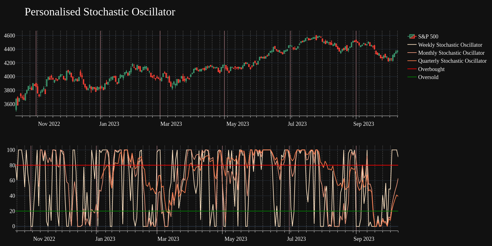

#### Fast Stochastic
Calculates the `fast_stochastic`
```python
# Bulk function
# Dropping the last value to demonstrate the use of the single function. This would obviously not be done normally
fast_stochastic = bulk_oscillators.fast_stochastic(weekly_so[:-1], 5, 'ema')

# Single function
fast_stochastic.append(single_oscillators.fast_stochastic(weekly_so[-5:], 'ema'))
```
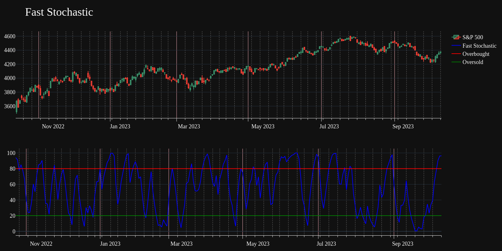

#### Slow Stochastic
Calculates the `slow_stochastic`
```python
# Bulk function 
# Once again the last item is dropped to demonstrate how the single version is called
slow_stochastic = bulk_oscillators.slow_stochastic(fast_stochastic[:-1], 5, 'ema')

# Single function
slow_stochastic.append(single_oscillators.slow_stochastic(fast_stochastic[-5:], 'ema'))
```
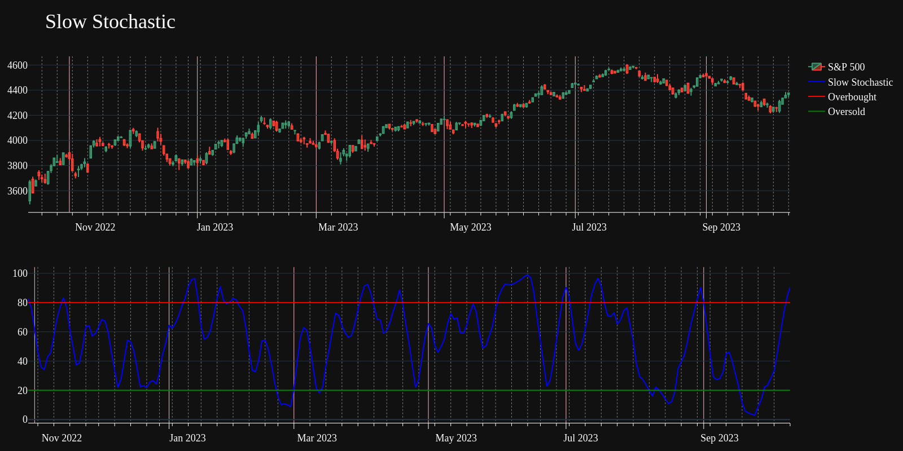

#### Slow Stochastic DS
Calculates the `slow_stochastic_ds`
```python
# Bulk function
# Once again the last item is dropped to demonstrate how the single version is called
slow_stochastic_ds = bulk_oscillators.slow_stochastic_ds(slow_stochastic[:-1], 5, 'ema')

# Single function
slow_stochastic_ds.append(single_oscillators.slow_stochastic_ds(slow_stochastic[-5:], 'ema'))
```
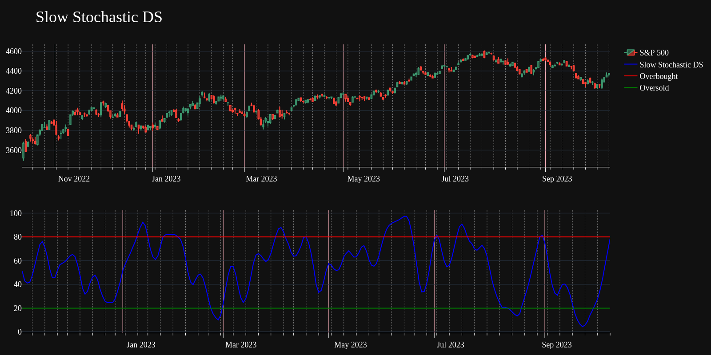

#### Visualizing the stochastics
Just a chart to see the stochastics together

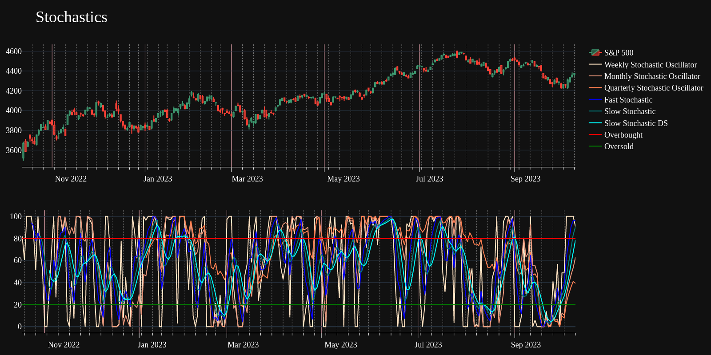

#### Money Flow Index
Calculates the `money_flow_index`
```python
# Bulk function
money_flow_index = bulk_oscillators.money_flow_index(data['Typical Price'].tolist(), data['Volume'].tolist())

# Single function
money_flow_index.append(single_oscillators.money_flow_index(data['Typical Price'][-13:].tolist()+[latest_typical_price], data['Volume'][-13:].tolist()+[latest_volume]))
```
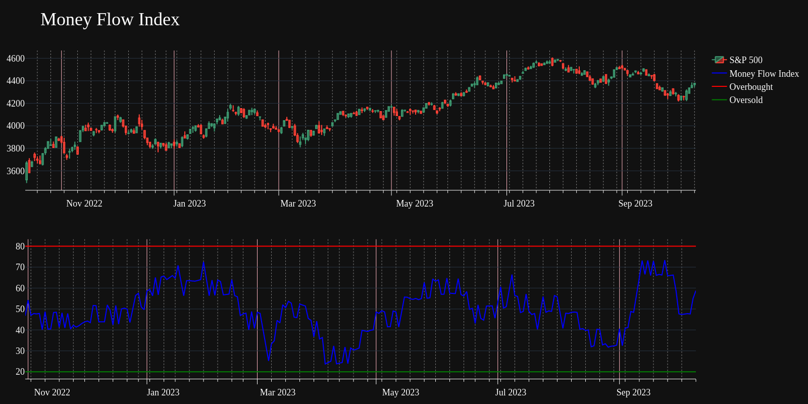

`money_flow_index` allows for the caller to personalise it by choosing their own period.
```python
# Bulk functions
weekly_personalised_mfi = bulk_oscillators.money_flow_index(data['Typical Price'].tolist(), data['Volume'].tolist(), 5)
monthly_personalised_mfi = bulk_oscillators.money_flow_index(data['Typical Price'].tolist(), data['Volume'].tolist(), 20)
quarterly_personalised_mfi = bulk_oscillators.money_flow_index(data['Typical Price'].tolist(), data['Volume'].tolist(), 60)

# Single functions
weekly_personalised_mfi.append(single_oscillators.money_flow_index(data['Typical Price'][-4:].tolist()+[latest_typical_price], data['Volume'][-4:].tolist()+[latest_volume]))
monthly_personalised_mfi.append(single_oscillators.money_flow_index(data['Typical Price'][-19:].tolist()+[latest_typical_price], data['Volume'][-19:].tolist()+[latest_volume]))
quarterly_personalised_mfi.append(single_oscillators.money_flow_index(data['Typical Price'][-59:].tolist()+[latest_typical_price], data['Volume'][-59:].tolist()+[latest_volume]))
```
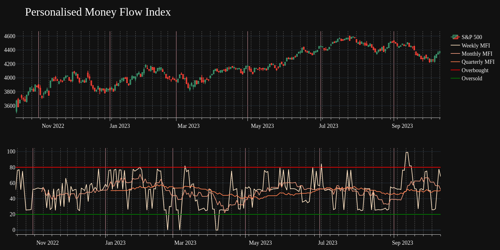

#### Chaikin Oscillator
Calculates the `chaikin_oscillator`
```python
# Bulk function
chaikin_oscillator = bulk_oscillators.chaikin_oscillator(data['High'].tolist(), data['Low'].tolist(), data['Close'].tolist(), data['Volume'].tolist())

# Single function

chaikin_oscillator.append(single_oscillators.chaikin_oscillator(
    data['High'][-9:].tolist() + [latest_high],
    data['Low'][-9:].tolist() + [latest_low],
    data['Close'][-9:].tolist() + [latest_close],
    data['Volume'][-9:].tolist() + [latest_volume]))
```
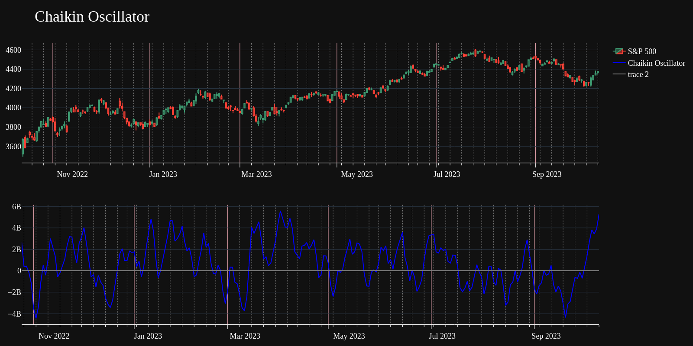

Caller can determine the short period, long period and moving average model to personalise the function.
```python
# Bulk function
personalised_co = bulk_oscillators.chaikin_oscillator(data['High'].tolist(), data['Low'].tolist(), data['Close'].tolist(), data['Volume'].tolist(), 5, 20, 'ema')

# Single function
personalised_co.append(single_oscillators.chaikin_oscillator(
    data['High'][-19:].tolist() + [latest_high],
    data['Low'][-19:].tolist() + [latest_low],
    data['Close'][-19:].tolist() + [latest_close],
    data['Volume'][-19:].tolist() + [latest_volume], 5, 'ema'))
```
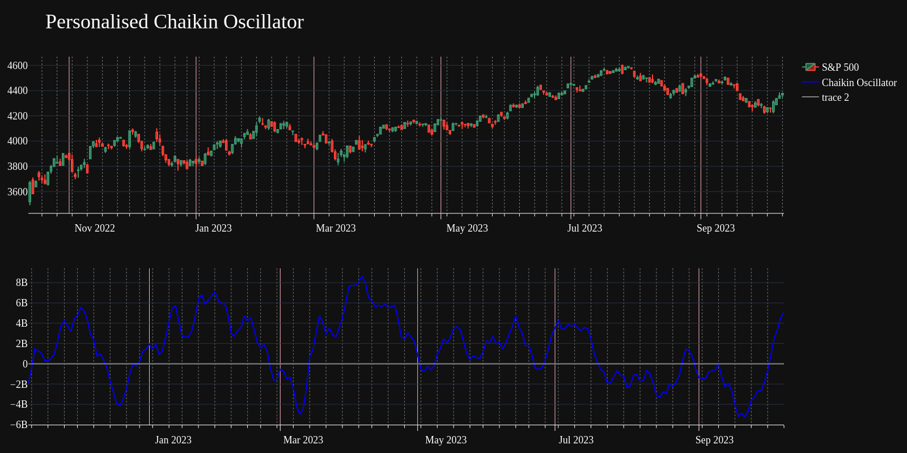

#### Williams %R
Calculates the `williams_percent_r`
```python
# Bulk functions
weekly_williams_percent_r = bulk_oscillators.williams_percent_r(data['High'].tolist(), data['Low'].tolist(), data['Close'].tolist(), 5)
monthly_williams_percent_r = bulk_oscillators.williams_percent_r(data['High'].tolist(), data['Low'].tolist(), data['Close'].tolist(), 20)
quarterly_williams_percent_r = bulk_oscillators.williams_percent_r(data['High'].tolist(), data['Low'].tolist(), data['Close'].tolist(), 60)

# Single functions
weekly_williams_percent_r.append(single_oscillators.williams_percent_r(latest_high, latest_low, latest_close))
monthly_williams_percent_r.append(single_oscillators.williams_percent_r(latest_high, latest_low, latest_close))
quarterly_williams_percent_r.append(single_oscillators.williams_percent_r(latest_high, latest_low, latest_close))
```
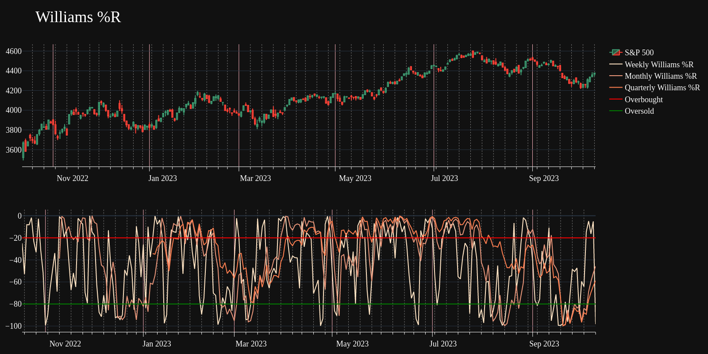

### Strength Indicators

#### Relative Strength Index
Calculates the `relative_strength_index`
```python
# Bulk function
rsi = bulk_strength_indicators.relative_strength_index(data['Typical Price'].tolist())
# Single function
rsi.append(single_strength_indicators.relative_strength_index(data['Typical Price'][-13:].tolist() + [latest_typical_price]))
```
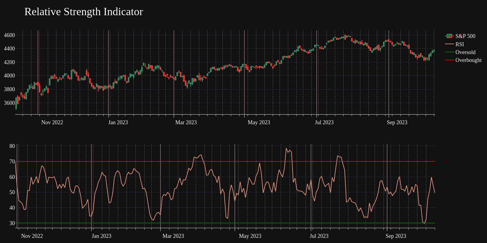

Caller can decide the period and moving average model to personalise the indicator.
```python
# Bulk functions
weekly_rsi = bulk_strength_indicators.relative_strength_index(data['Typical Price'].tolist(), 5, 'ema')
monthly_rsi = bulk_strength_indicators.relative_strength_index(data['Typical Price'].tolist(), 20, 'ema')
quarterly_rsi = bulk_strength_indicators.relative_strength_index(data['Typical Price'].tolist(), 60, 'ema')

# Single functions
weekly_rsi.append(single_strength_indicators.relative_strength_index(data['Typical Price'][-4:].tolist() + [latest_typical_price], 'ema'))
monthly_rsi.append(single_strength_indicators.relative_strength_index(data['Typical Price'][-19:].tolist() + [latest_typical_price], 'ema'))
quarterly_rsi.append(single_strength_indicators.relative_strength_index(data['Typical Price'][-59:].tolist() + [latest_typical_price], 'ema'))
```
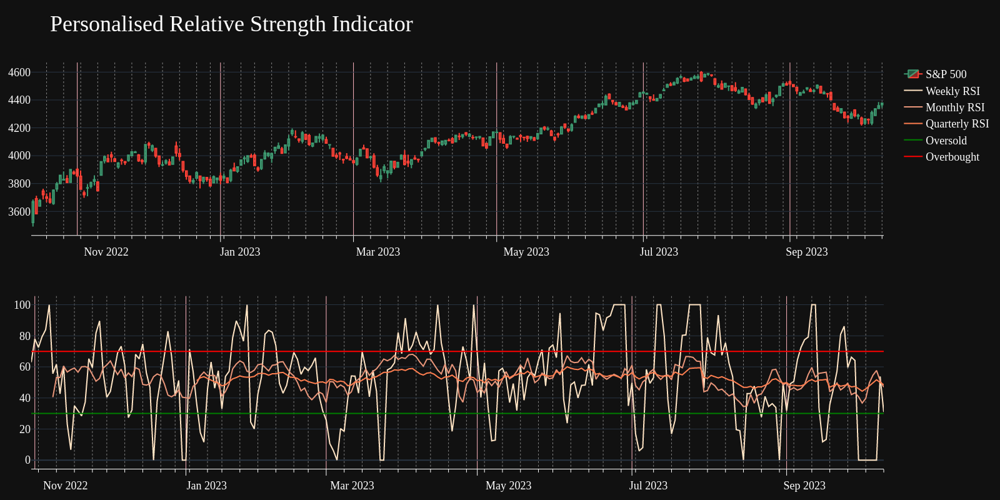

#### Accumulation Distribution Indicator
Calculates the `accumulation_distribution_indicator`
```python
# Bulk functions
adi = bulk_strength_indicators.accumulation_distribution_indicator(data['High'].tolist(), data['Low'].tolist(), data['Close'].tolist(), data['Volume'].tolist())
# Single functions
adi.append(single_strength_indicators.accumulation_distribution_indicator(
    latest_high,
    latest_low,
    latest_close,
    latest_volume,
    adi[-1]
))
```
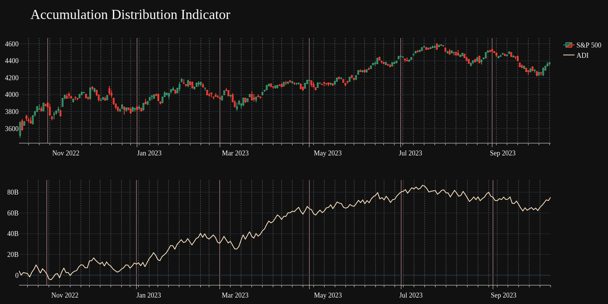

#### Directional Indicator, Directional Index, Average Directional Index, Average Directional Index Rating
Calcualtes the `directional_indicator`, `directional_index`, `average_directional_index`, and 
`average_directional_index_rating`
```python
# Bulk functions
weekly_di = bulk_strength_indicators.directional_indicator(data['High'].tolist(), data['Low'].tolist(), data['Close'].tolist(), 5)
weekly_positive_di = [di[0] for di in weekly_di]
weekly_negative_di = [di[1] for di in weekly_di]
weekly_dx = bulk_strength_indicators.directional_index(weekly_positive_di, weekly_negative_di)
weekly_adx = bulk_strength_indicators.average_directional_index(weekly_dx, 5, 'ema')
weekly_adxr = bulk_strength_indicators.average_directional_index_rating(weekly_adx, 5)

monthly_di = bulk_strength_indicators.directional_indicator(data['High'].tolist(), data['Low'].tolist(), data['Close'].tolist(), 20)
monthly_positive_di = [di[0] for di in monthly_di]
monthly_negative_di = [di[1] for di in monthly_di]
monthly_dx = bulk_strength_indicators.directional_index(monthly_positive_di, monthly_negative_di)
monthly_adx = bulk_strength_indicators.average_directional_index(monthly_dx, 20, 'ema')
monthly_adxr = bulk_strength_indicators.average_directional_index_rating(monthly_adx, 20)

quarterly_di = bulk_strength_indicators.directional_indicator(data['High'].tolist(), data['Low'].tolist(), data['Close'].tolist(), 60)
quarterly_positive_di = [di[0] for di in quarterly_di]
quarterly_negative_di = [di[1] for di in quarterly_di]
quarterly_dx = bulk_strength_indicators.directional_index(quarterly_positive_di, quarterly_negative_di)
quarterly_adx = bulk_strength_indicators.average_directional_index(quarterly_dx, 60, 'ema')
quarterly_adxr = bulk_strength_indicators.average_directional_index_rating(quarterly_adx, 60)

# Single functions
weekly_di.append(single_strength_indicators.directional_indicator_known_previous(
    latest_high,
    data['High'].iloc[-1],
    latest_low,
    data['Low'].iloc[-1],
    data['Close'].iloc[-1],
    weekly_di[-1][2],
    weekly_di[-1][0],
    weekly_di[-1][1],
    5
))
weekly_dx.append(single_strength_indicators.directional_index(weekly_di[-1][0], weekly_di[-1][1]))
weekly_adx.append(single_strength_indicators.average_directional_index(weekly_dx[-5:], 'ema'))
weekly_adxr.append(single_strength_indicators.average_directional_index_rating(weekly_adx[-1], weekly_adx[-5]))

monthly_di.append(single_strength_indicators.directional_indicator_known_previous(
    latest_high,
    data['High'].iloc[-1],
    latest_low,
    data['Low'].iloc[-1],
    data['Close'].iloc[-1],
    monthly_di[-1][2],
    monthly_di[-1][0],
    monthly_di[-1][1],
    20
))
monthly_dx.append(single_strength_indicators.directional_index(monthly_di[-1][0], monthly_di[-1][1]))
monthly_adx.append(single_strength_indicators.average_directional_index(monthly_dx[-20:], 'ema'))
monthly_adxr.append(single_strength_indicators.average_directional_index_rating(monthly_adx[-1], monthly_adx[-20]))

quarterly_di.append(single_strength_indicators.directional_indicator_known_previous(
    latest_high,
    data['High'].iloc[-1],
    latest_low,
    data['Low'].iloc[-1],
    data['Close'].iloc[-1],
    quarterly_di[-1][2],
    quarterly_di[-1][0],
    quarterly_di[-1][1],
    60
))
quarterly_dx.append(single_strength_indicators.directional_index(quarterly_di[-1][0], quarterly_di[-1][1]))
quarterly_adx.append(single_strength_indicators.average_directional_index(quarterly_dx[-60:], 'ema'))
quarterly_adxr.append(single_strength_indicators.average_directional_index_rating(quarterly_adx[-1], quarterly_adx[-60]))
```
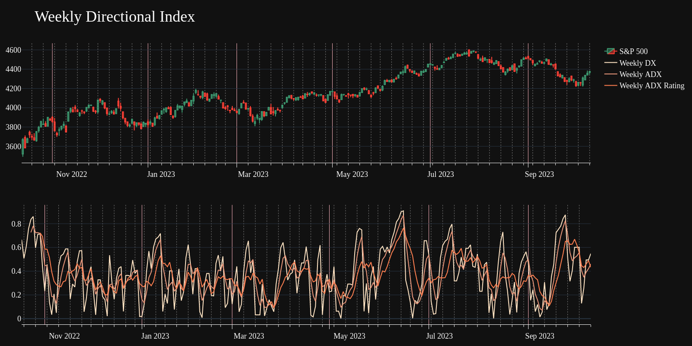
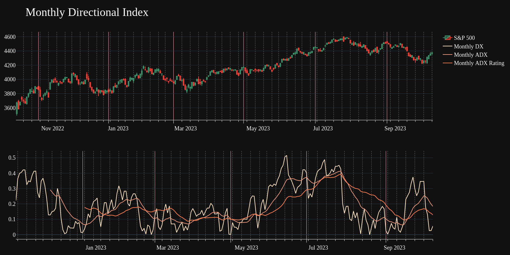
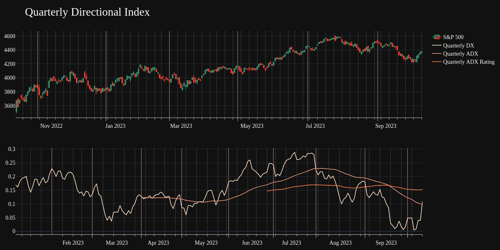

### Momentum Indicators

#### Rate of Change
Calculates the `rate_of_change`
```python
# Bulk functions
weekly_roc = bulk_momentum_indicators.rate_of_change(data['Typical Price'].tolist(), 5)
monthly_roc = bulk_momentum_indicators.rate_of_change(data['Typical Price'].tolist(), 20)
quarterly_roc = bulk_momentum_indicators.rate_of_change(data['Typical Price'].tolist(), 60)

# Single functions
weekly_roc.append(single_momentum_indicators.rate_of_change(latest_typical_price, data['Typical Price'].iloc[-4]))
monthly_roc.append(single_momentum_indicators.rate_of_change(latest_typical_price, data['Typical Price'].iloc[-19]))
quarterly_roc.append(single_momentum_indicators.rate_of_change(latest_typical_price, data['Typical Price'].iloc[-59]))
```
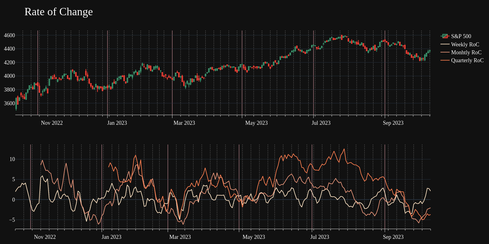

#### On Balance Volume
Calculates the `on_balance_volume`
```python
# Bulk function
obv = bulk_momentum_indicators.on_balance_volume(data['Close'].tolist(), data['Volume'].tolist())

# Single function
obv.append(single_momentum_indicators.on_balance_volume(latest_close, data['Close'].iloc[-1], latest_volume, data['Volume'].iloc[-1]))
```
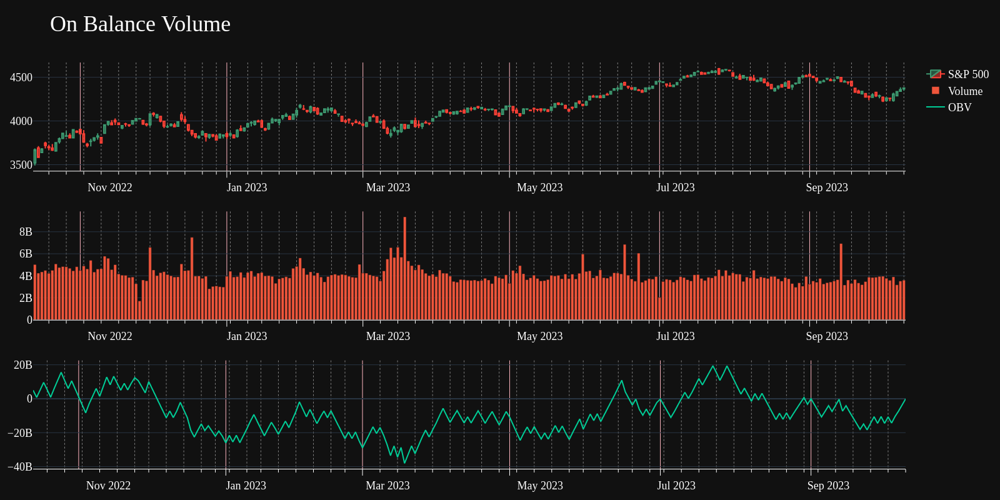

#### Commodity Channel Index
Calculates the `commodity_channel_index`
```python
# Bulk functions
weekly_cci = bulk_momentum_indicators.commodity_channel_index(data['Typical Price'].tolist(), 5, 'ema', 'median')
monthly_cci = bulk_momentum_indicators.commodity_channel_index(data['Typical Price'].tolist(), 20, 'ema', 'median')
quarterly_cci = bulk_momentum_indicators.commodity_channel_index(data['Typical Price'].tolist(), 60, 'ema', 'median')

# Single functions
weekly_cci.append(single_momentum_indicators.commodity_channel_index(data['Typical Price'][-4:].tolist() + [latest_typical_price], 'ema', 'median'))
monthly_cci.append(single_momentum_indicators.commodity_channel_index(data['Typical Price'][-19:].tolist() + [latest_typical_price], 'ema', 'median'))
quarterly_cci.append(single_momentum_indicators.commodity_channel_index(data['Typical Price'][-59:].tolist() + [latest_typical_price], 'ema', 'median'))
```
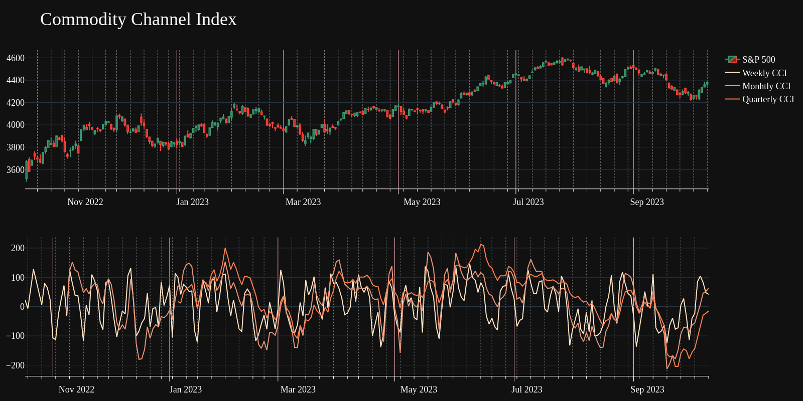

### Trend Indicators

#### Aroon Oscillator
Calculates the `aroon_up`, `aroon_down`, `aroon_oscillator`
```python
# Bulk functions
aroon_up = bulk_trend_indicators.aroon_up(data['High'].tolist())
aroon_down = bulk_trend_indicators.aroon_down(data['Low'].tolist())
aroon_oscillator = bulk_trend_indicators.aroon_oscillator(data['High'].tolist(), data['Low'].tolist())

# Single functions
aroon_up.append(single_trend_indicators.aroon_up(data['High'][-26:].tolist() + [latest_high]))
aroon_down.append(single_trend_indicators.aroon_down(data['Low'][-26:].tolist() + [latest_low]))
aroon_oscillator.append(single_trend_indicators.aroon_oscillator(data['High'][-26:].tolist() + [latest_high], data['Low'][-26:].tolist() + [latest_low]))
```
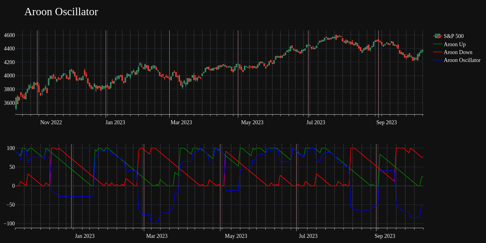

The caller can choose a period to personalise the indicator
```python
# Bulk functions
weekly_aroon_up = bulk_trend_indicators.aroon_up(data['High'].tolist(), 5)
weekly_aroon_down = bulk_trend_indicators.aroon_down(data['Low'].tolist(), 5)
weekly_aroon_oscillator = bulk_trend_indicators.aroon_oscillator(data['High'].tolist(), data['Low'].tolist(), 5)

# Single functions
weekly_aroon_up.append(single_trend_indicators.aroon_up(data['High'][-6:].tolist() + [latest_high], 5))
weekly_aroon_down.append(single_trend_indicators.aroon_down(data['Low'][-6:].tolist() + [latest_low], 5))
weekly_aroon_oscillator.append(single_trend_indicators.aroon_oscillator(data['High'][-6:].tolist() + [latest_high], data['Low'][-6:].tolist() + [latest_low], 5))

# Bulk functions
monthly_aroon_up = bulk_trend_indicators.aroon_up(data['High'].tolist(), 20)
monthly_aroon_down = bulk_trend_indicators.aroon_down(data['Low'].tolist(), 20)
monthly_aroon_oscillator = bulk_trend_indicators.aroon_oscillator(data['High'].tolist(), data['Low'].tolist(), 20)

# Single functions
monthly_aroon_up.append(single_trend_indicators.aroon_up(data['High'][-21:].tolist() + [latest_high], 20))
monthly_aroon_down.append(single_trend_indicators.aroon_down(data['Low'][-21:].tolist() + [latest_low], 20))
monthly_aroon_oscillator.append(single_trend_indicators.aroon_oscillator(data['High'][-21:].tolist() + [latest_high], data['Low'][-21:].tolist() + [latest_low], 20))

# Bulk functions
quarterly_aroon_up = bulk_trend_indicators.aroon_up(data['High'].tolist(), 60)
quarterly_aroon_down = bulk_trend_indicators.aroon_down(data['Low'].tolist(), 60)
quarterly_aroon_oscillator = bulk_trend_indicators.aroon_oscillator(data['High'].tolist(), data['Low'].tolist(), 60)

# Single functions
quarterly_aroon_up.append(single_trend_indicators.aroon_up(data['High'][-61:].tolist() + [latest_high], 60))
quarterly_aroon_down.append(single_trend_indicators.aroon_down(data['Low'][-61:].tolist() + [latest_low], 60))
quarterly_aroon_oscillator.append(single_trend_indicators.aroon_oscillator(data['High'][-61:].tolist() + [latest_high], data['Low'][-61:].tolist() + [latest_low], 60))
```
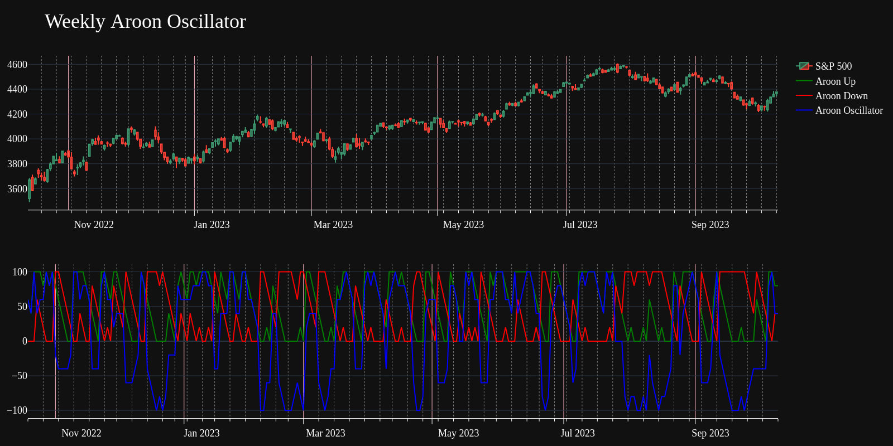
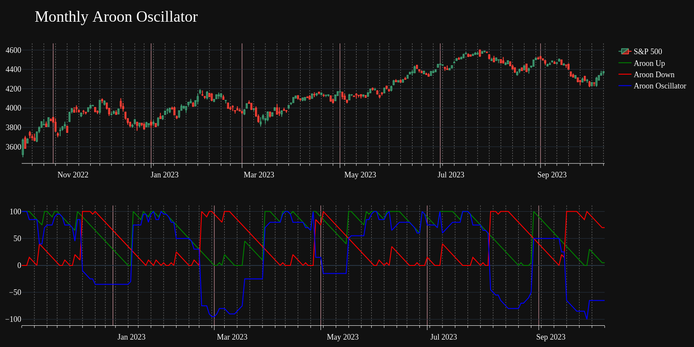
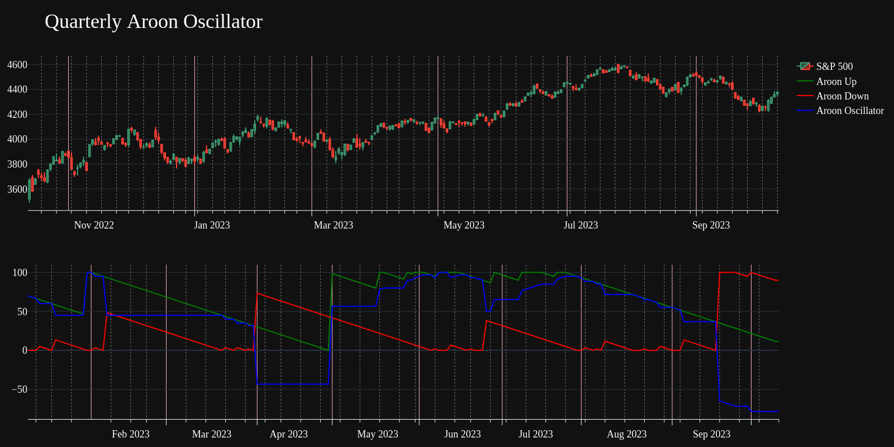

#### Parabolic Stop and Reverse
Calculates the `parabolic_sar`
```python
# Bulk functions
weekly_parabolic_sar = bulk_trend_indicators.parabolic_sar(data['High'].tolist(), data['Low'].tolist(), data['Close'].tolist(), 5)
monthly_parabolic_sar = bulk_trend_indicators.parabolic_sar(data['High'].tolist(), data['Low'].tolist(), data['Close'].tolist(), 20)
quarterly_parabolic_sar = bulk_trend_indicators.parabolic_sar(data['High'].tolist(), data['Low'].tolist(), data['Close'].tolist(), 60)

# Single functions
weekly_parabolic_sar.append(single_trend_indicators.parabolic_sar(
    data['High'][-4:].tolist() + [latest_high],
    data['Low'][-4:].tolist() + [latest_low],
    data['Close'][-4:].tolist() + [latest_close],
    weekly_parabolic_sar[-1][0],
    weekly_parabolic_sar[-1][1],
    weekly_parabolic_sar[-1][2],
    weekly_parabolic_sar[-1][3],
))
monthly_parabolic_sar.append(single_trend_indicators.parabolic_sar(
    data['High'][-19:].tolist() + [latest_high],
    data['Low'][-19:].tolist() + [latest_low],
    data['Close'][-19:].tolist() + [latest_close],
    monthly_parabolic_sar[-1][0],
    monthly_parabolic_sar[-1][1],
    monthly_parabolic_sar[-1][2],
    monthly_parabolic_sar[-1][3],
))
quarterly_parabolic_sar.append(single_trend_indicators.parabolic_sar(
    data['High'][-59:].tolist() + [latest_high],
    data['Low'][-59:].tolist() + [latest_low],
    data['Close'][-59:].tolist() + [latest_close],
    quarterly_parabolic_sar[-1][0],
    quarterly_parabolic_sar[-1][1],
    quarterly_parabolic_sar[-1][2],
    quarterly_parabolic_sar[-1][3],
))
```
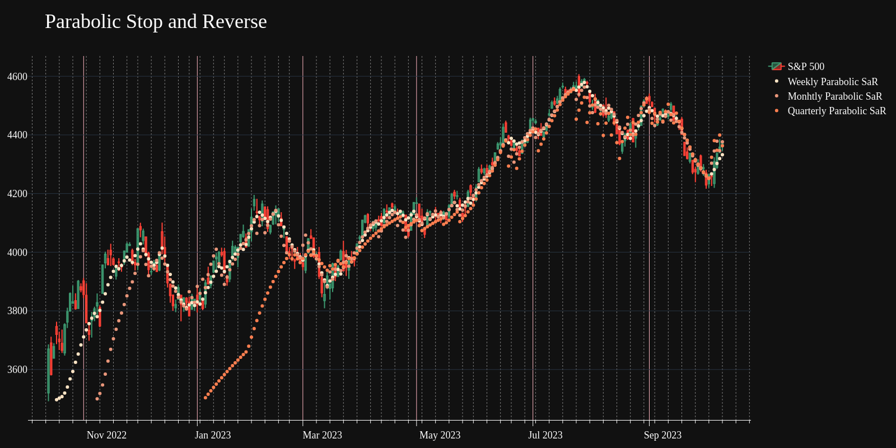

### Candle Indicators
#### Bollinger Bands
Calculates the `bollinger_bands`. Returns the lower band, upper band, and moving average.
```python
# Bulk function
bollinger_bands = bulk_candle_indicators.bollinger_bands(data['Typical Price'].tolist())

# Single function
bollinger_bands.append(single_candle_indicators.bollinger_bands(data['Typical Price'][-19:].tolist() + [latest_typical_price]))
```
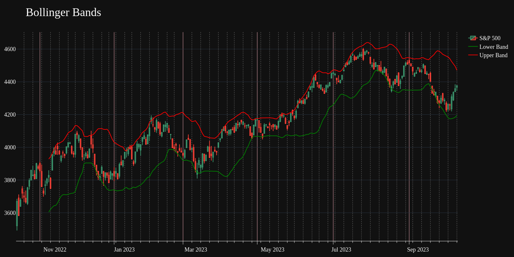

Can be personalised by changing the period, moving average model, and/or the standard deviation multiplier.
```python
# Bulk functions
weekly_bband = bulk_candle_indicators.bollinger_bands(data['Typical Price'].tolist(), 5, 'ema', 2)
monthly_bband = bulk_candle_indicators.bollinger_bands(data['Typical Price'].tolist(), 20, 'ema', 2)
quarterly_bband = bulk_candle_indicators.bollinger_bands(data['Typical Price'].tolist(), 60, 'ema', 2)

# Single functions
weekly_bband.append(single_candle_indicators.bollinger_bands(
    data['Typical Price'][-4:].tolist() + [latest_typical_price],
    'ema',
    2
))
monthly_bband.append(single_candle_indicators.bollinger_bands(
    data['Typical Price'][-19:].tolist() + [latest_typical_price],
    'ema',
    2
))
quarterly_bband.append(single_candle_indicators.bollinger_bands(
    data['Typical Price'][-59:].tolist() + [latest_typical_price],
    'ema',
    2
))
```
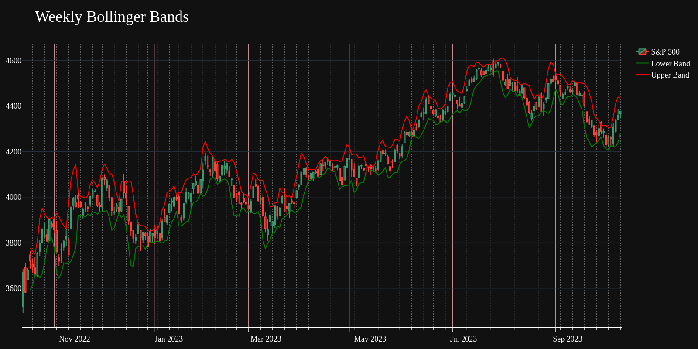
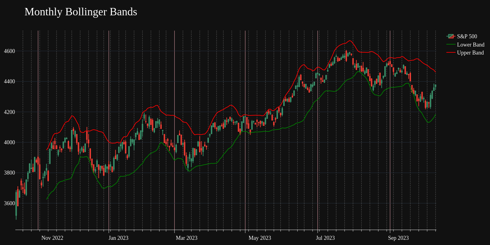


#### Ichimoku Cloud
Calculates the `ichimoku_cloud`
```python
# Bulk function
ichimoku_cloud = bulk_candle_indicators.ichimoku_cloud(data['High'].tolist(), data['Low'].tolist(), data['Close'].tolist())

# Single function
ichimoku_cloud.append(single_candle_indicators.ichimoku_cloud(
    data['High'][-59:].tolist() + [latest_high],
    data['Low'][-59:].tolist() + [latest_low],
    data['Close'][-59:].tolist() + [latest_close]
))
```
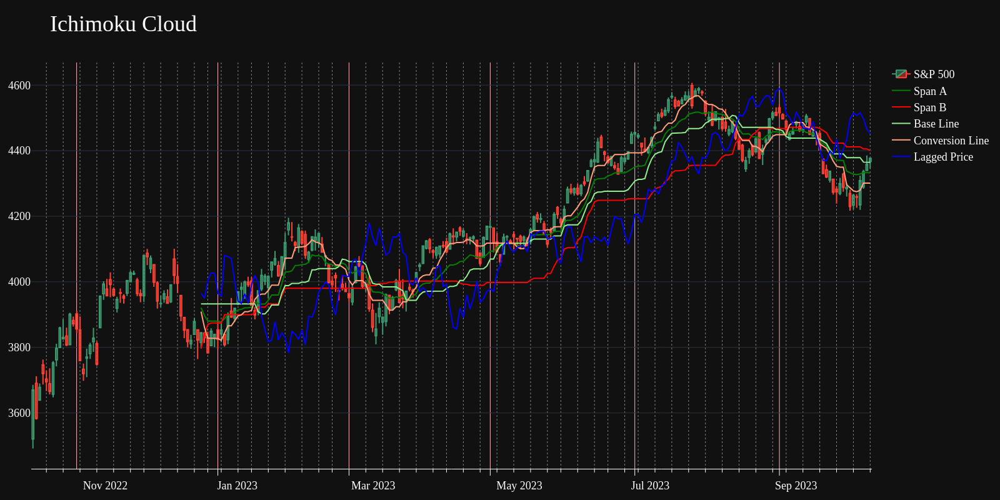

Caller can personalise the indicator by changing the `conversion_period`, `base_period`, and `span_b_period`
```python
# Bulk function
personalised_ichimoku_cloud = bulk_candle_indicators.ichimoku_cloud(data['High'].tolist(), data['Low'].tolist(), data['Close'].tolist(), 5, 20, 60)

# Single function
personalised_ichimoku_cloud.append(single_candle_indicators.ichimoku_cloud(
    data['High'][-60:].tolist() + [latest_high],
    data['Low'][-60:].tolist() + [latest_low],
    data['Close'][-60:].tolist() + [latest_close],
    5, 20, 60
))
```
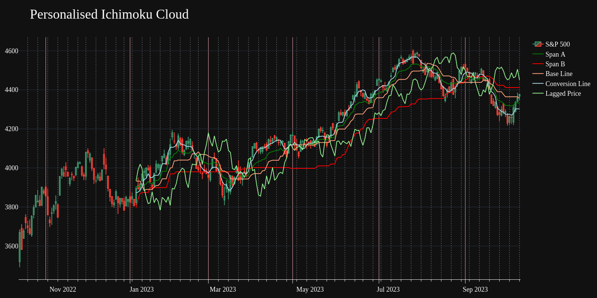

### Volatility

#### Average True Range
Calculates the `average_true_range`
```python
# Bulk functions
weekly_atr = bulk_volatility_indicators.average_true_range(
    data['High'].tolist(),
    data['Low'].tolist(),
    data['Close'].tolist(),
    5
)
monthly_atr = bulk_volatility_indicators.average_true_range(
    data['High'].tolist(),
    data['Low'].tolist(),
    data['Close'].tolist(),
    20
)
quarterly_atr = bulk_volatility_indicators.average_true_range(
    data['High'].tolist(),
    data['Low'].tolist(),
    data['Close'].tolist(),
    60
)

# Single functions
weekly_atr.append(single_volatility_indicators.average_true_range(latest_high, latest_low, data['Close'].iloc[-1], weekly_atr[-1], 5))
monthly_atr.append(single_volatility_indicators.average_true_range(latest_high, latest_low, data['Close'].iloc[-1], weekly_atr[-1], 20))
quarterly_atr.append(single_volatility_indicators.average_true_range(latest_high, latest_low, data['Close'].iloc[-1], weekly_atr[-1], 60))
```
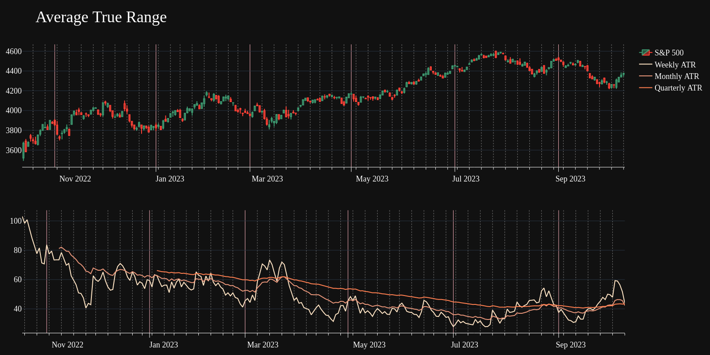

#### Ulcer Index
Calculates the `ulcer_index`
```python
# Bulk functions
weekly_ui = bulk_volatility_indicators.ulcer_index(data['Close'].tolist(), 5)
monthly_ui = bulk_volatility_indicators.ulcer_index(data['Close'].tolist(), 20)
quarterly_ui = bulk_volatility_indicators.ulcer_index(data['Close'].tolist(), 60)

# Single functions
weekly_ui.append(data['Close'][-4:].tolist() + [latest_close])
monthly_ui.append(data['Close'][-19:].tolist() + [latest_close])
quarterly_ui.append(data['Close'][-59:].tolist() + [latest_close])
```
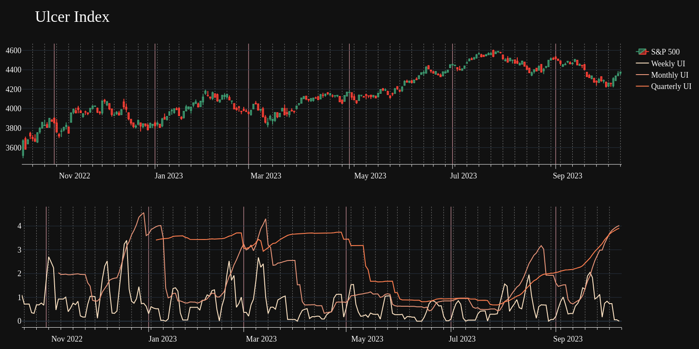

#### Welles Volatility Index
Calculates the `volatility_index`
```python
# Bulk function
weekly_vi = bulk_volatility_indicators.volatility_index(
    data['High'].tolist(),
    data['Low'].tolist(),
    data['Close'].tolist(),
    5
)
monthly_vi = bulk_volatility_indicators.volatility_index(
    data['High'].tolist(),
    data['Low'].tolist(),
    data['Close'].tolist(),
    20
)
quarterly_vi = bulk_volatility_indicators.volatility_index(
    data['High'].tolist(),
    data['Low'].tolist(),
    data['Close'].tolist(),
    60
)

# Single function
weekly_vi.append(single_volatility_indicators.volatility_index(
    latest_high,
    latest_low,
    latest_close,
    5,
    weekly_vi[-1]
))
monthly_vi.append(single_volatility_indicators.volatility_index(
    latest_high,
    latest_low,
    latest_close,
    20,
    monthly_vi[-1]
))
quarterly_vi.append(single_volatility_indicators.volatility_index(
    latest_high,
    latest_low,
    latest_close,
    60,
    quarterly_vi[-1]
))
```
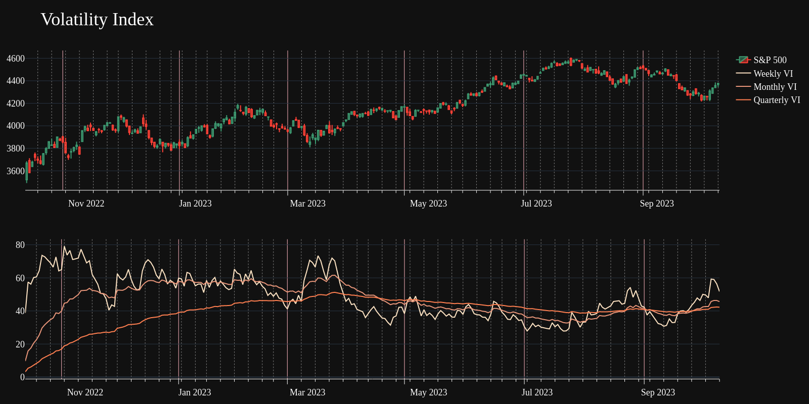

#### Welles Volatility System
Calculates Welles `volatility_system`
```python
# Bulk functions
weekly_vs = bulk_volatility_indicators.volatility_system(
    data['High'].tolist(),
    data['Low'].tolist(),
    data['Close'].tolist(),
    5,
    2
)
monthly_vs = bulk_volatility_indicators.volatility_system(
    data['High'].tolist(),
    data['Low'].tolist(),
    data['Close'].tolist(),
    20,
    2
)
quarterly_vs = bulk_volatility_indicators.volatility_system(
    data['High'].tolist(),
    data['Low'].tolist(),
    data['Close'].tolist(),
    60,
    2
)

# Single functions
weekly_vs.append(single_volatility_indicators.volatility_system(
    data['High'][-4:].tolist() + [latest_high],
    data['Low'][-4:].tolist() + [latest_low],
    data['Close'][-4:].tolist() + [latest_close],
    5,
    2,
    weekly_vs[-1]
))
monthly_vs.append(single_volatility_indicators.volatility_system(
    data['High'][-19:].tolist() + [latest_high],
    data['Low'][-19:].tolist() + [latest_low],
    data['Close'][-19:].tolist() + [latest_close],
    20,
    2,
    monthly_vs[-1]
))
quarterly_vs.append(single_volatility_indicators.volatility_system(
    data['High'][-59:].tolist() + [latest_high],
    data['Low'][-59:].tolist() + [latest_low],
    data['Close'][-59:].tolist() + [latest_close],
    60,
    2,
    quarterly_vs[-1]
))
```
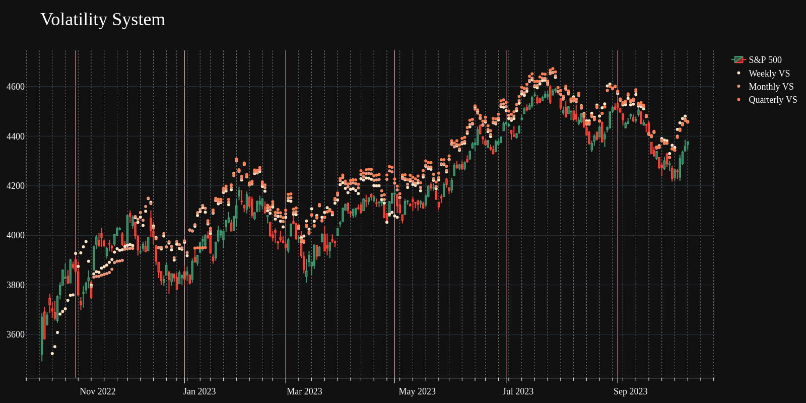

### Correlation

##### Correlate asset prices
Calculates the `correlate_asset_prices`
```python
# Second dataset setup
data2 = pandas.read_csv("example2.csv", sep=',', index_col=0, parse_dates=True)
data2.index.name = 'Date'
data2['Typical Price'] = (data2['High'] + data2['Low'] + data2['Close']) / 3
data2.sort_index(inplace=True)

# Bulk functions
weekly_correlation = bulk_correlation_indicators.correlate_asset_prices(data['Typical Price'].tolist(), data2['Typical Price'].tolist(), 5)
monthly_correlation = bulk_correlation_indicators.correlate_asset_prices(data['Typical Price'].tolist(), data2['Typical Price'].tolist(), 20)
quarterly_correlation = bulk_correlation_indicators.correlate_asset_prices(data['Typical Price'].tolist(), data2['Typical Price'].tolist(), 60)

# Single functions
weekly_correlation.append(single_correlation_indicators.correlate_asset_prices(
    data['Typical Price'][-4:].tolist() + [latest_typical_price],
    data2['Typical Price'][-4:].tolist() + [52]
))
monthly_correlation.append(single_correlation_indicators.correlate_asset_prices(
    data['Typical Price'][-19:].tolist() + [latest_typical_price],
    data2['Typical Price'][-19:].tolist() + [52]
))
quarterly_correlation.append(single_correlation_indicators.correlate_asset_prices(
    data['Typical Price'][-59:].tolist() + [latest_typical_price],
    data2['Typical Price'][-59:].tolist() + [52]
))
```
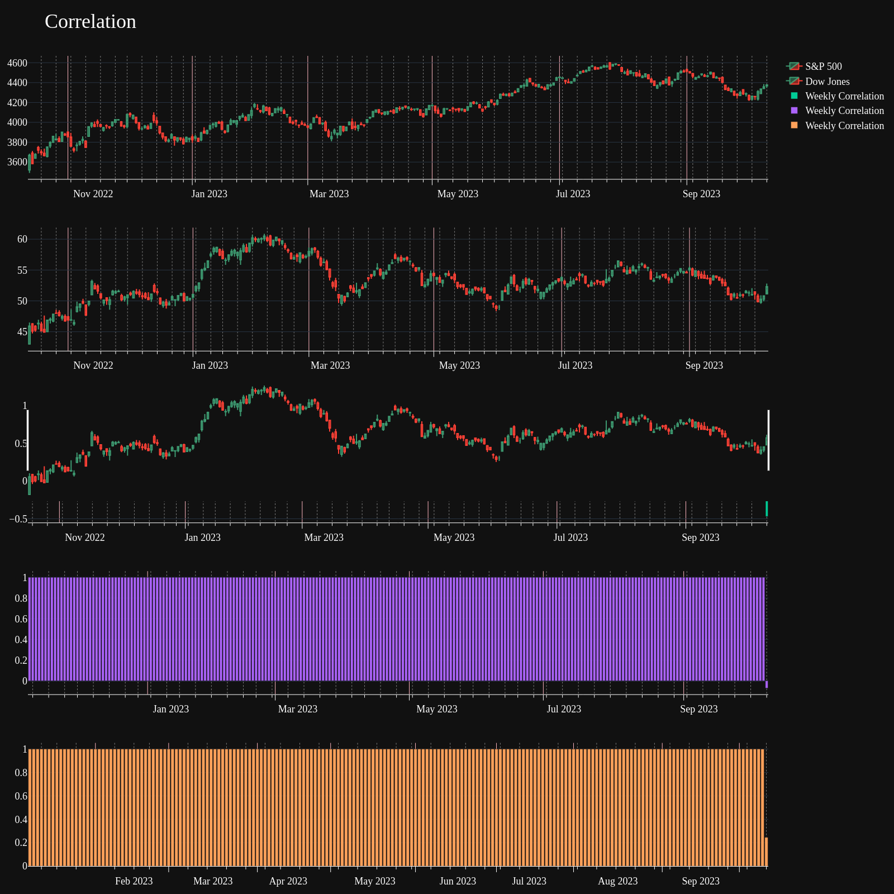

### Support and resistance indicators

#### Pivot points
Calculates the `pivot_points`
```python
# Bulk function
pivot_points = bulk_support_resistance_indicators.pivot_points(data['High'].tolist(), data['Low'].tolist(), data['Close'].tolist())

# Single function
pivot_points.append(single_support_resistance_indicators.pivot_points(latest_high, latest_low, latest_close))
```
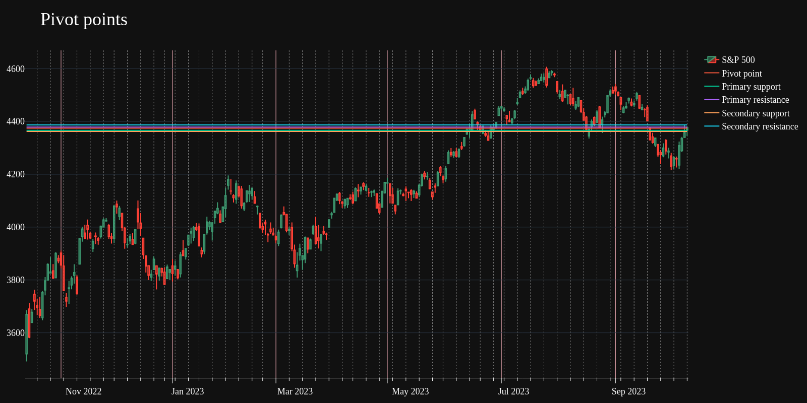

### Other indicators

#### Return on investment
Calculates the `return_on_investment`
```python
# Bulk function
return_on_investment = bulk_other_indicators.return_on_investment(data['Typical Price'].tolist())

# Single function
return_on_investment.append(single_other_indicators.return_on_investment(data['Typical Price'].iloc[-1], latest_typical_price, return_on_investment[-1][0]))
```
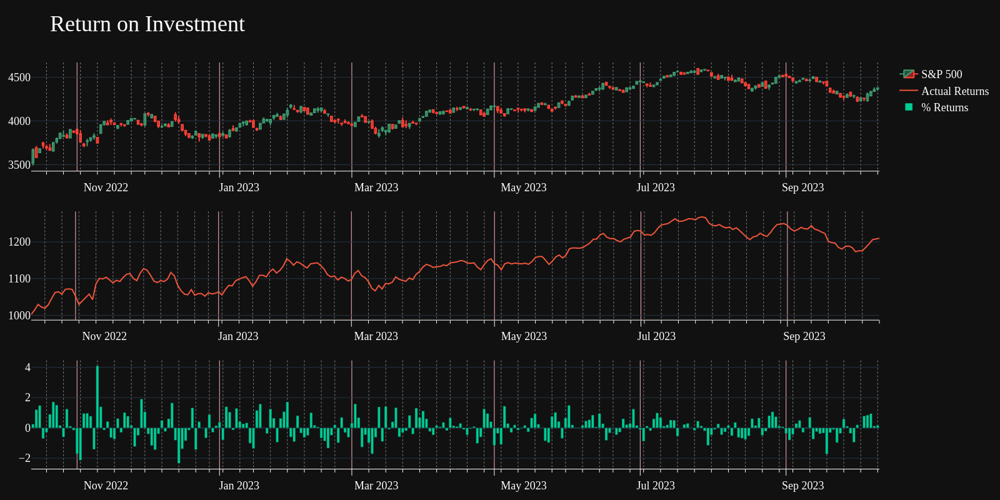

### Chart Patterns

#### Get peaks
Calculates the `peaks` for a list of prices.
```python
weekly_peaks = peaks.get_peaks(data['High'].tolist() + [latest_high], 5)
monthly_peaks = peaks.get_peaks(data['High'].tolist() + [latest_high], 20)
quarterly_peaks = peaks.get_peaks(data['High'].tolist() + [latest_high], 60)
```
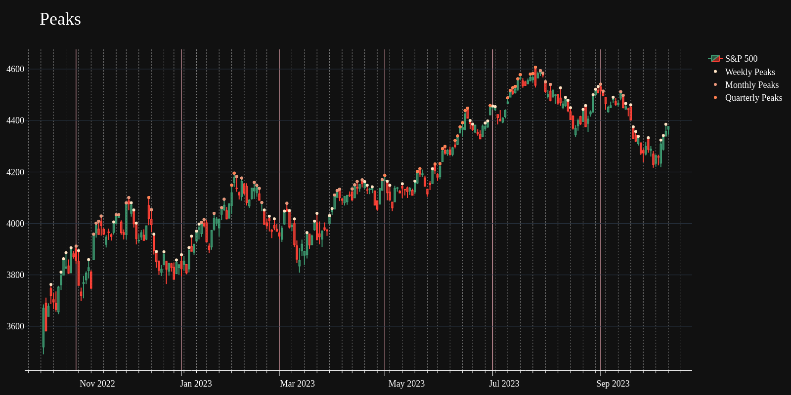

### Valleys

#### Get Valleys
Calculates the `valleys` for a list of prices
```python
weekly_valleys = valleys.get_valleys(data['Low'].tolist() + [latest_low], 5)
monthly_valleys = valleys.get_valleys(data['Low'].tolist() + [latest_low], 20)
quarterly_valleys = valleys.get_valleys(data['Low'].tolist() + [latest_low], 60)
```


### Chart Trends

#### Get Peak Trend
Calculates the `get_peak_trend` for a list of prices.
```python
weekly_peak_trend = chart_trends.get_peak_trend(data['High'].tolist() + [latest_high], 5)
monthly_peak_trend = chart_trends.get_peak_trend(data['High'].tolist() + [latest_high], 20)
quarterly_peak_trend = chart_trends.get_peak_trend(data['High'].tolist() + [latest_high], 60)
```
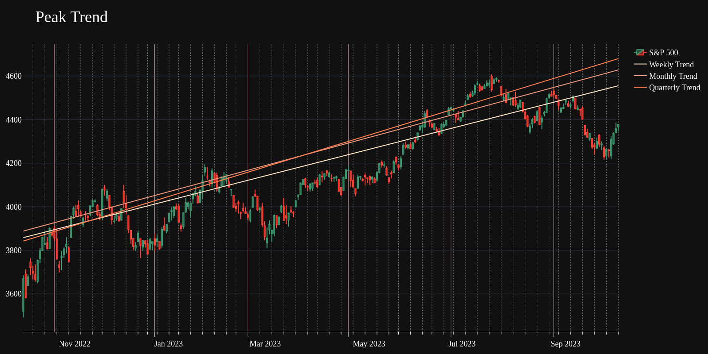

#### Get Valley Trend
Calculates the `get_valley_trend` for a list of prices
```python
weekly_valley_trend = chart_trends.get_valley_trend(data['Low'].tolist() + [latest_low], 5)
monthly_valley_trend = chart_trends.get_valley_trend(data['Low'].tolist() + [latest_low], 20)
quarterly_valley_trend = chart_trends.get_valley_trend(data['Low'].tolist() + [latest_low], 60)
```
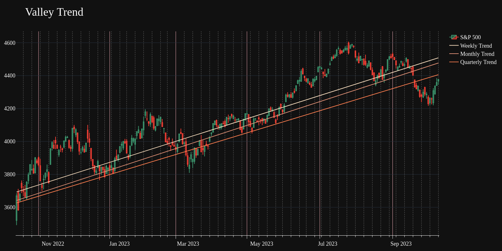

#### Get overall trend
Calculates the `get_overall_trend` for a list of prices
```python
overall_trend = chart_trends.get_overall_trend(data['Typical Price'].tolist() + [latest_typical_price])
```
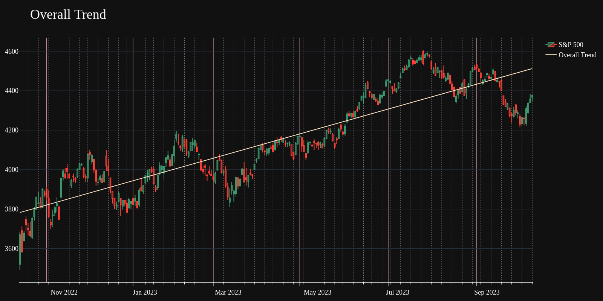

#### Break Down Trends
Calculates the `break_down_trends` for a list of prices. 
```python
trends_default_sensitivity = chart_trends.break_down_trends(data['Typical Price'].tolist())
trends_low_sensitivity = chart_trends.break_down_trends(data['Typical Price'].tolist(), standard_deviation_multiplier=1)
trends_high_sensitivity = chart_trends.break_down_trends(data['Typical Price'].tolist(), standard_deviation_multiplier=5)
trends_low_denominator = chart_trends.break_down_trends(data['Typical Price'].tolist(), standard_deviation_multiplier=2, sensitivity_multiplier=0.1)
trends_high_denom = chart_trends.break_down_trends(data['Typical Price'].tolist(), standard_deviation_multiplier=2, sensitivity_multiplier=100)
```
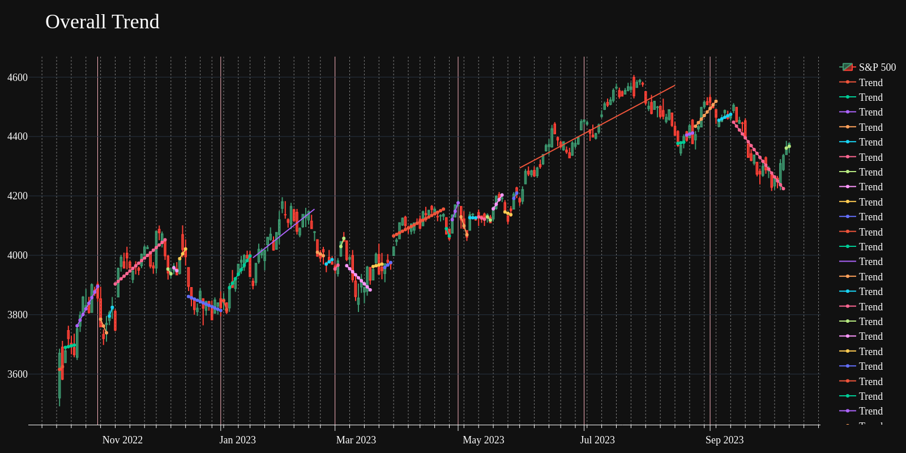
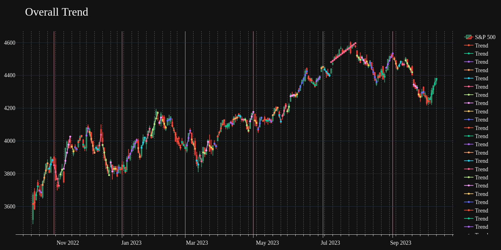


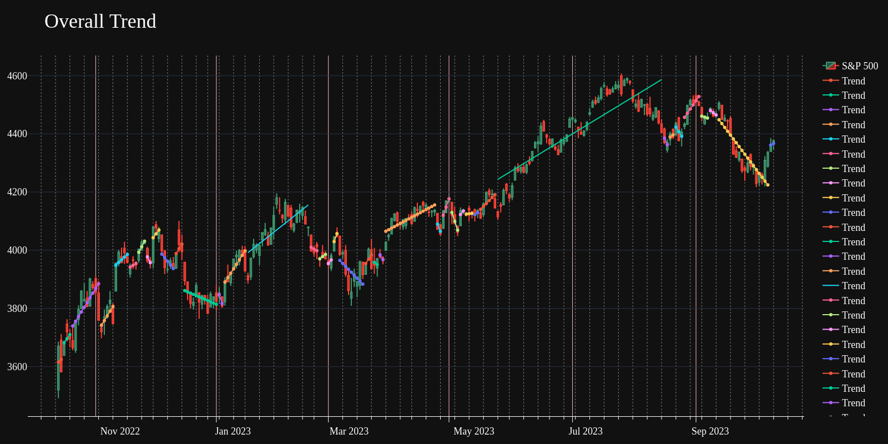
